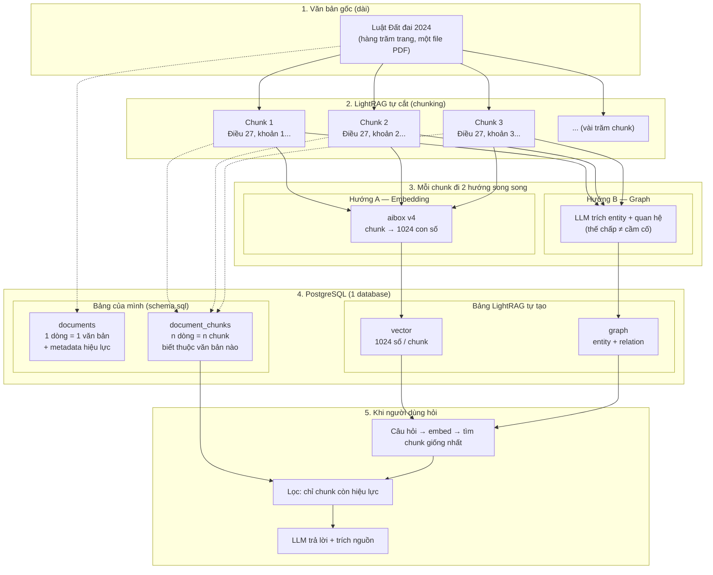

# Minh họa: Chunk văn bản → PostgreSQL (LightRAG ingest)

> Mục đích: giải thích bằng hình cho người mới hiểu luồng dữ liệu.
> Không phải plan triển khai — là bản vẽ giáo dục. | 2026-08-10 | Tiếng Việt

## Diagram 1 — Tổng quan luồng (1 trang)

## Giải thích từng bước (bằng lời)

### Bước 1 — Văn bản dài
Bạn có một file PDF "Luật Đất đai 2024" — dài hàng trăm trang. AI không đọc hết được một lượt.

### Bước 2 — LightRAG tự cắt (chunk)
Khi bạn đưa file vào, LightRAG **tự cắt** thành từng đoạn nhỏ (~1200 token/đoạn, chồng lấn 200).
Điểm hay: cắt **theo điều/khoản** — chunk 1 = Điều 27 khoản 1, chunk 2 = Điều 27 khoản 2...

### Bước 3 — Mỗi chunk đi 2 hướng
- **Hướng A (Embedding):** chunk → aibox v4 → dãy **1024 con số**. Dãy số tóm tắt "ý nghĩa" đoạn văn.
- **Hướng B (Graph):** LLM đọc chunk → trích entity ("thế chấp", "cầm cố", "điều 28") + quan hệ giữa chúng.

### Bước 4 — Lưu vào PostgreSQL (1 database, 2 nhóm bảng)

| Nhóm | Bảng | Nội dung |
|---|---|---|
| **Của mình** | `documents` | 1 dòng = 1 văn bản: tên, số hiệu, ngày hiệu lực, trạng thái |
| **Của mình** | `document_chunks` | n dòng = n chunk: thuộc văn bản nào, chunk thứ mấy, nội dung |
| **LightRAG tự tạo** | vector | 1024 số cho mỗi chunk (embedding) |
| **LightRAG tự tạo** | graph | entity + quan hệ (nút + cạnh) |

### Bước 5 — Người dùng hỏi
Câu hỏi → embed thành vector → tìm **chunk giống nhất** (bảng vector) + tra **graph** →
lấy nội dung thật từ `document_chunks` → **lọc chỉ trả chunk thuộc văn bản còn hiệu lực** →
LLM viết câu trả lời **kèm trích nguồn** (số hiệu văn bản, điều khoản).

## Vì sao tách 2 nhóm bảng? (điểm quan trọng)

- **Bảng vector/graph của LightRAG** = "bộ não tìm kiếm" — nhanh, nhưng KHÔNG biết văn bản còn hiệu lực không.
- **Bảng documents/document_chunks của mình** = "sổ đăng ký" — biết văn bản nào còn hiệu lực, giá nào còn áp dụng.
- Khi truy vấn, **mình JOIN hai cái**: tìm được chunk giống nhất (bộ não) → kiểm tra hiệu lực (sổ đăng ký) → mới đưa cho LLM. Nhờ vậy **không bao giờ trả văn bản hết hiệu lực hoặc giá cũ** cho người dùng.

## Ví dụ mini cụ thể

**Input:** câu hỏi "Đất cầm có hợp pháp không?"

1. Embed câu hỏi → tìm chunk giống nhất → ra 3 chunk từ bảng vector
2. JOIN `document_chunks` → thấy chunk thuộc văn bản "Luật Đất đai 2024" (còn hiệu lực ✓)
3. Tra graph → thấy entity "thế chấp" (hợp pháp) ≠ entity "cầm cố" (không được ghi nhận)
4. LLM trả lời: "Cầm cố QSDĐ không được Luật Đất đai 2024 ghi nhận (Điều 27 khoản 3)..."
5. Kèm trích nguồn: [Luật Đất đai 2024, Điều 27] ✅
