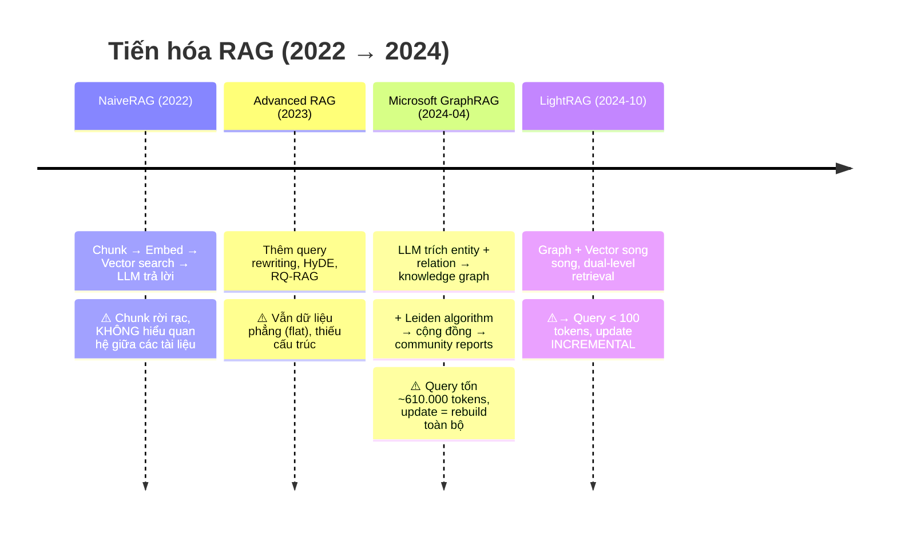
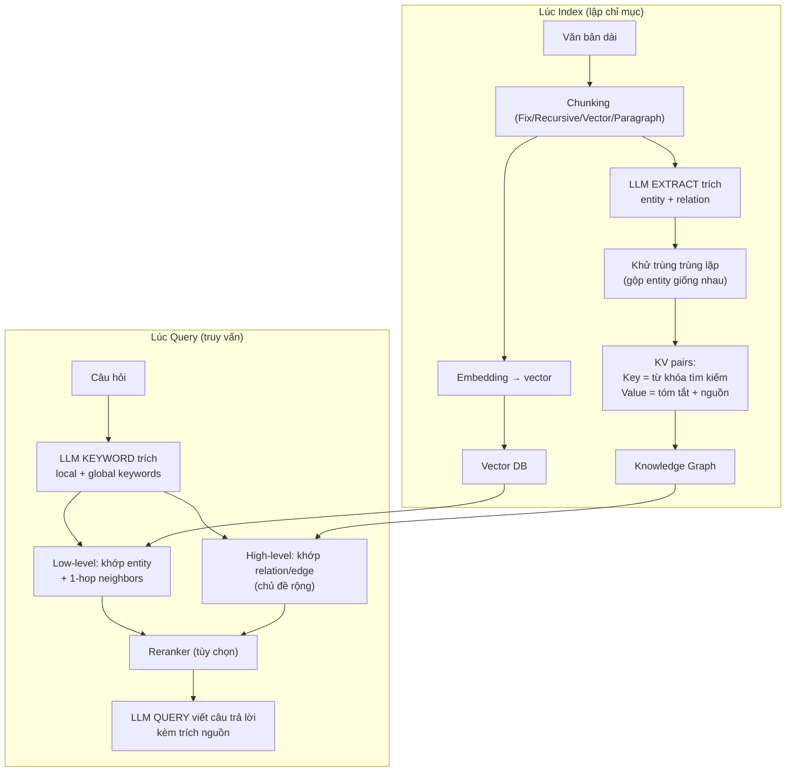
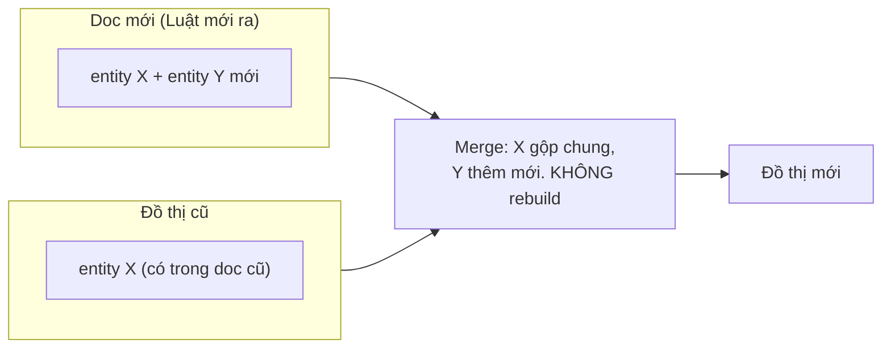

# LightRAG — Toàn tập: từ trước khi có nó → phương thức chi tiết → tránh bug

> Mục đích: giúp bạn **am hiểu và code không bị bug** khi làm dự án với LightRAG.
> Gồm 3 phần: (A) Bối cảnh trước khi LightRAG ra đời, (B) Tổng quan + kiến trúc, (C) Phương thức API chi tiết + lỗi thường gặp.
> Nguồn: repo chính thức HKUDS/LightRAG + docs + troubleshooting | 2026-08-10 | Tiếng Việt

---

## Phần A — Trước khi có LightRAG, thế giới RAG như thế nào?



### 1. NaiveRAG (2022) — "dò chữ trong sách"
- Cách làm: cắt văn bản thành **chunk** → **embed** mỗi chunk thành vector → lưu vector DB →
  câu hỏi cũng embed → tìm chunk **giống nhất** (cosine similarity) → đưa chunk + LLM → trả lời.
- **Sai lầm cố hữu:** mỗi chunk là 1 hòn đảo cô lập. Hỏi *"thế chấp và cầm cố khác nhau thế nào?"*
  → NaiveRAG kéo về 2 chunk có chữ giống nhau, **không biết** chúng thuộc 2 điều luật liên quan nhau.

### 2. Microsoft GraphRAG (tháng 4/2024) — "cuộc cách mạng đồ thị"
- Cách làm: LLM trích **entity + relation** → dựng **knowledge graph** → **Leiden algorithm**
  gom cụm thành **cộng đồng (community)** → viết **community reports**.
- 2 chế độ query: **local** (entity cụ thể) HOẶC **global** (map-reduce qua community reports).
- **Vấn đề:**
  | Tiêu chí | GraphRAG |
  |---|---|
  | Chi phí query | ~610.000 tokens (đọc hàng trăm báo cáo cộng đồng) |
  | Cập nhật dữ liệu mới | **Rebuild toàn bộ** community (cực tốn) |
  | Buộc chọn mode | local *hoặc* global, không làm cả hai cùng lúc |

### 3. LightRAG (tháng 10/2024, EMNLP 2025) — "GraphRAG nhẹ + nhanh + rẻ"
Giữ nguyên ưu điểm graph, **bỏ 3 cái giá phải trả** của GraphRAG:
- **Query < 100 tokens** (không đọc community reports) — rẻ hơn ~6000x.
- **Incremental update** — thêm tài liệu mới chỉ gộp node/edge, **không rebuild**.
- **Dual-level retrieval** — chạy **cả local lẫn global đồng thời**, không phải chọn 1.

> **Vì sao dự án rag-real-estate chọn LightRAG:** dữ liệu pháp lý/giá thay đổi ~6 tháng/lần →
> cần incremental update (LightRAG) chứ không thể rebuild (GraphRAG). Benchmark 2025-2026:
> LightRAG 84.8% vs NaiveRAG 15-40% trên tài liệu liên chéo văn bản.

---

## Phần B — Tổng quan LightRAG (repo HKUDS/LightRAG)

> PyPI: `lightrag-hku` | Python ≥ 3.10 | MIT | EMNLP 2025 | ~38.7k stars | 1.5.6 (2026-08-06, dự án LOCK)

### 1. Triết lý: "Graph + Vector song song, không phải thay thế"



### 2. 5 Query Modes (chọn qua `QueryParam(mode=...)`)

| Mode | Nghĩa | Dùng khi | Dự án legal dùng |
|---|---|---|---|
| `local` | Chỉ low-level: entity cụ thể + lân cận | Hỏi sự kiện/điều khoản cụ thể | ✅ |
| `global` | Chỉ high-level: chủ đề rộng, xuyên tài liệu | Hỏi tổng quan, xu hướng | ✅ |
| `hybrid` | local + global song song | Câu hỏi vừa chi tiết vừa tổng quan | ✅ |
| `naive` | Pure vector, KHÔNG dùng graph | Chunk đơn giản, không cần quan hệ | ⚠️ |
| `mix` | local + global + naive | **Default** — "đầy đủ nhất" | ✅ khuyến nghị |

### 3. 4 vai trò LLM riêng biệt (mỗi vai cấu hình độc lập)

| Vai trò | Làm gì | Khuyến nghị |
|---|---|---|
| **EXTRACT** | Trích entity/relation lúc index | Model rẻ, **non-thinking**, nhanh (Claude Haiku / DeepSeek-V4-lite / Qwen3) |
| **QUERY** | Viết câu trả lời cuối | Model **mạnh hơn** EXTRACT, thinking OK |
| **KEYWORD** | Trích keyword từ câu hỏi | **Bắt buộc non-thinking** (latency thấp) |
| **VLM** | Phân tích hình ảnh (Word/PDF có hình) | Chỉ khi `VLM_PROCESS_ENABLE=true` |

> ⚠️ Nếu dùng 1 model cho tất cả 4 vai → latency cao + kém chất lượng trích xuất.
> Dự án dùng: **deepseek-v4-flash** cho query (có thể chia vai sau).

### 4. 4 loại storage (XÁC ĐỊNH trước lần index đầu tiên)

| Loại | Lưu gì | PG (dự án chọn) |
|---|---|---|
| `KV_STORAGE` | Cache LLM, chunk, kết quả extraction | `PGKVStorage` |
| `VECTOR_STORAGE` | Vector entity/relation/chunk | `PGVectorStorage` |
| `GRAPH_STORAGE` | Knowledge graph | **`PGTableGraphStorage`** (bảng thuần, JSONB — KHÔNG AGE) |
| `DOC_STATUS_STORAGE` | Trạng thái tài liệu | `PGDocStatusStorage` |

> **Quyết định dự án (ADR-001):** `PGTableGraphStorage` — chạy trên PG managed
> (RDS/Supabase/Neon/Viettel VPS), nhanh hơn AGE ~20x, tránh bug Apache AGE.
> `PGGraphStorage` (AGE) = cài extension nặng, không chạy được hầu hết managed PG.

### 6. ⭐ Vai trò chính xác khi cài đặt: LightRAG TỰ LÀM gì, ta PHẢI LÀM gì?

> Đây là câu hỏi quan trọng nhất khi cài đặt. Trả lời dứt khoát:

| Giai đoạn | LightRAG TỰ LÀM (chỉ cần inject model) | Ta PHẢI TỰ LÀM |
|---|---|---|
| **Ingest** | Parse/chunk văn bản ✓ · LLM EXTRACT trích entity/relation → graph ✓ · embedding → vector ✓ · incremental merge khi thêm doc ✓ | Sanitize doc chống **graph poisoning** (indirect prompt injection trong source) — LightRAG KHÔNG có |
| **Retrieval** | LLM KEYWORD **trích keyword** (không phải rewrite) ✓ · dual-level search (graph + vector) ✓ · rerank (nếu bật) ✓ · gom context ✓ | **Query rewriting** (HyDE...) nếu muốn — LightRAG KHÔNG làm, chỉ extract keywords |
| **Trả lời** | **MẶC ĐỊNH tự gọi LLM QUERY viết câu trả lời** khi bạn gọi `aquery()` ✓ | Dùng `only_need_context=True` → lấy context về, TỰ build prompt + gọi LLM riêng (dự án legal NÊN làm: thêm citation/confidence/lọc hiệu lực) |
| **Bảo mật** | ❌ KHÔNG có gì | Input guardrail (chống prompt injection) · Output guardrail · Auth/rate-limit API (LightRAG server mặc định KHÔNG auth — có CVE) · Lọc hiệu lực effective_date/status |

**3 điểm mấu chốt cho dự án rag-real-estate:**

1. **`aquery()` mặc định trả về câu trả lời HOÀN CHỈNH** (LightRAG tự gọi LLM QUERY). Nhưng legal cần citation + confidence + filter hiệu lực → dùng **`only_need_context=True`**: LightRAG chỉ trả về context (chunk + entity/relation) đã retrieval, **KHÔNG gọi LLM trả lời** → ta tự lọc hiệu lực → tự build prompt → gọi deepseek-v4-flash → thêm nguồn trích dẫn. Đây là cách chuẩn cho dự án luật.
2. **Guardrails KHÔNG có sẵn** — LightRAG không phải sản phẩm bảo mật (không input filter, không chống graph poisoning, server mặc định không auth — CVE-2026-61808/61740). Ta phải xây 4 lớp defense (đã có AD-6 trong spine) + auth riêng.
3. **KHÔNG có query rewriting** — chỉ có **keyword extraction** (tách query thành `high_level_keywords` + `low_level_keywords` cho 2 đường retrieval). Muốn rewrite (HyDE/step-back) thì tự làm TRƯỚC khi gọi query, hoặc inject sẵn `hl_keywords`/`ll_keywords` vào `QueryParam` để bỏ qua LLM.

### 7. QueryParam — các cờ quan trọng

| Cờ | Giá trị | Tác dụng |
|---|---|---|
| `only_need_context` | `True` | Chỉ lấy context retrieval, KHÔNG gọi LLM trả lời (dự án dùng) |
| `only_need_prompt` | `True` | Chỉ lấy prompt đã gom, không gọi LLM |
| `top_k` | 60 (graph) | Số entity/relation lấy từ graph |
| `chunk_top_k` | 20 (vector) | Số chunk lấy từ vector search |
| `hl_keywords` / `ll_keywords` | list | Inject sẵn keyword → bỏ qua LLM KEYWORD |
| `max_total_tokens` | 30000 → **8-12k legal** | Giới hạn context gửi LLM |
| `enable_rerank` | `True` | Bật reranker |
| `user_prompt` | str | Thêm hướng dẫn cho LLM trả lời (KHÔNG ảnh hưởng retrieval) |
| `conversation_history` | list | Lịch sử chat (KHÔNG dùng cho retrieval) |

### 5. Chunking — 4 chiến lược (chọn qua `LIGHTRAG_PARSER`)

| Chiến lược | Cách cắt | Dùng khi |
|---|---|---|
| `Fix` | Độ dài cố định | Đơn giản, ghi chú |
| `Recursive` | Cắt theo ký tự đệ quy | Văn bản thường |
| `Vector` | Semantic theo vector | Văn bản dài, thay đổi chủ đề rõ |
| `Paragraph` (native) | **Theo ranh giới tự nhiên: đề mục, đoạn, bảng** | **✅ Văn bản pháp luật** (giữ Điều/Khoản nguyên vẹn) |

Tham số: `CHUNK_TOKEN_SIZE` (default 1200) + `CHUNK_OVERLAP_TOKENS` (default 200) trong `addon_params`.

---

## Phần C — Phương thức API chi tiết (để code không bug)

### 1. Khởi tạo — 2 bước BẮT BUỘC (quên = bug #1)

```python
rag = LightRAG(
    working_dir="./rag_data",
    llm_model_func=deepseek_complete,   # callable bất kỳ — KHÔNG khóa OpenAI/Anthropic!
    embedding_func=your_embedv4,         # EmbeddingFunc (bắt buộc khai báo dims)
    kv_storage="PGKVStorage",
    vector_storage="PGVectorStorage",
    graph_storage="PGTableGraphStorage",
    doc_status_storage="PGDocStatusStorage",
)
await rag.initialize_storages()      # BẮT BUỘC #1
await initialize_pipeline_status()   # BẮT BUỘC #2 (quên → KeyError: 'history_messages')
```

### 2. Bảng phương thức chính

| Phương thức | Đồng bộ/Async | Công dụng | Lưu ý |
|---|---|---|---|
| `insert` / `ainsert` | cả 2 | Thêm văn bản: `ainsert(text)`, `ainsert([...], ids=[...], file_paths=[...])` | `file_paths` → citation tracking |
| `ainsert_string` | async | Thêm 1 string với kiểm soát | |
| `query` / `aquery` | cả 2 | `aquery(q, param=QueryParam(mode="hybrid"))` | QueryParam: mode, top_k, only_need_context, stream |
| `adelete_by_doc_id` | **chỉ async** | Xóa 1 văn bản + tự tái tạo graph ảnh hưởng | KHÔNG thể hoàn tác |
| `initialize_storages` | async | Tạo bảng/schema storage | Gọi trước MỌI thao tác |
| `finalize_storages` | async | Đóng connection | Cuối chương trình |
| `get_docs_by_status` | async | Xem trạng thái tài liệu (processed/pending) | |

### 3. `llm_model_func` — KHÔNG khóa giao thức (trả lời câu hỏi proxy LLM của bạn)

- `llm_model_func` chỉ là **một callable** `(prompt, system_prompt, history_messages, keyword_extraction, **kwargs) -> str`.
- LightRAG có sẵn: `gpt_4o_mini_complete`, `openai_complete_if_cache`, `ollama_model_complete`,
  `gemini_model_complete`... — nhưng **bạn tự viết được hàm gọi bất kỳ API nào** (kể cả proxy
  không chuẩn OpenAI), miễn trả về `str`.
- → **Kết luận proxy LLM của bạn (aibox gateway): KHẢ THI.** Chỉ cần viết 1 wrapper gọi
  `api.ai-box.vn/v1/chat/completions` và truyền vào `llm_model_func`.
- ⚠️ **Hàm phải xử lý được `keyword_extraction=True`** (LightRAG gọi với flag này) và lịch sử
  `history_messages` — đọc kỹ signature của `openai_complete_if_cache` làm mẫu.

### 4. `embedding_func` — phải là `EmbeddingFunc` có khai báo dims

```python
@wrap_embedding_func_with_attrs(embedding_dim=1024, max_token_size=8192)
async def embed_v4(texts: list[str]) -> np.ndarray:
    # gọi aibox /v1/embeddings, trả về mảng (n, 1024)
```

- **dims phải khớp** `EMBEDDING_DIM` (dự án: **1024 — đã LOCK, đổi = re-embed toàn bộ + drop bảng vector**).
- Đổi model = drop `LIGHTRAG_VDB_ENTITY/RELATION/CHUNKS` + index lại.

### 5. Rerank (tùy chọn, dự án dùng aibox qwen3-rerank)

- Không bắt buộc; thêm 1-2s latency. **Đổi lúc nào cũng được** (khác embedding — không phải re-index).
- LightRAG `generic_rerank_api` với `response_format="standard"` (Jina/Cohere-compatible).

### 6. Incremental update & delete (trái tim của dự án 6-tháng)



- **Thêm doc mới:** `ainsert` → chỉ trích xuất doc đó → merge vào graph cũ.
- **Xóa doc hết hiệu lực:** `adelete_by_doc_id` → xóa chunk, xóa entity/relation **chỉ thuộc doc đó**,
  **tái tạo** entity/relation dùng chung với doc khác (dùng LLM cache từ lúc index → nhanh).
- ⚠️ LightRAG **KHÔNG filter theo metadata** (effective_date/status) → dự án phải tự xây lớp lọc
  post-retrieval bằng bảng `documents` của mình (đã có trong `schema.sql`).

### 7. Cache — 3 tầng (tiết kiệm chi phí)

| Cache | Nội dung | Tắt/bật |
|---|---|---|
| LLM cache | Kết quả query trùng lặp | `ENABLE_LLM_CACHE` (mặc định ON) |
| Embedding cache | Vector đã tính | `embedding_cache_config` (similarity ≥0.95) |
| Extraction cache | Kết quả entity/relation (tốn nhất) | KV storage — **giữ lại** khi dọn cache |

Maintenance: `lightrag-clean-llmqc` (xóa cache query, GIỮ extraction cache) · `rebuild_vdb` (dựng lại vector từ graph + chunk).

---

## Phần D — Bảng "Những lỗi thường gặp khi code LightRAG" (checklist trước khi deploy)

| # | Lỗi (symptom) | Nguyên nhân | Cách tránh |
|---|---|---|---|
| 1 | `AttributeError: __aenter__` | Quên `initialize_storages()` | Luôn gọi sau khi khởi tạo |
| 2 | `KeyError: 'history_messages'` | Quên `initialize_pipeline_status()` | Gọi cả 2 bước |
| 3 | `DuplicateTableError` (v1.4.9.9) | Race tạo bảng không idempotent | **Dùng 1.4.10+ (dự án: 1.5.6 ✅)** |
| 4 | Nhiều instance workspace trùng | `POSTGRES_WORKSPACE` env dính | KHÔNG set global; dùng param `workspace` |
| 5 | `type "vector" does not exist` | Thiếu extension pgvector | `CREATE EXTENSION IF NOT EXISTS vector` |
| 6 | `expected 1024 dimensions, not 3072` | Đổi embedding model giữa chừng | **LOCK model từ đầu** (ADR-002) + drop bảng nếu đổi |
| 7 | Migration 17h+ khi upgrade | Query Cypher chậm (AGE) | Dùng `PGTableGraphStorage` (dự án chọn ✅) |
| 8 | Entity/relation properties rỗng | Bug Apache AGE #1721 | Tránh AGE hoàn toàn |
| 9 | Query chậm | `MAX_PARALLEL_INSERT` > `MAX_ASYNC_LLM` | set `MAX_PARALLEL_INSERT` ≈ 1/3 `MAX_ASYNC_LLM` |

### Checklist vàng (từ dự án rag-real-estate)

- [ ] **Lock embedding model** (aibox v4 dims 1024) TRƯỚC bất kỳ index nào — cấu hình 1 chỗ (env)
- [ ] Gọi `initialize_storages()` + `initialize_pipeline_status()` sau khi khởi tạo
- [ ] Storage config (PGTableGraphStorage + dims 1024) CHỐT trước lần upload đầu
- [ ] `top_k` + `max_total_tokens` 8-12k cho legal (context không phình quá lớn)
- [ ] Xây lớp **post-retrieval filter** hiệu lực (LightRAG không tự lọc metadata)
- [ ] Citation (source_ids) + confidence 3-tier + golden set regression mỗi update 6 tháng
- [ ] Backup pg_dump TRƯỚC khi upgrade LightRAG (migration có thể destructive)

---

## Liên kết với dự án

- Repo: `HKUDS/LightRAG` → dùng làm **pip library** (`lightrag-hku`), KHÔNG fork (không cần source riêng).
- Customize qua: `llm_model_func` (deepseek-v4-flash qua aibox) · `embedding_func` (aibox v4) ·
  storage classes (PG) · parsing (native-Paragraph cho văn bản luật).
- Tài liệu gốc: `docs/ProgramingWithCore.md` trong repo · ví dụ `lightrag_openai_compatible_demo.py`.
