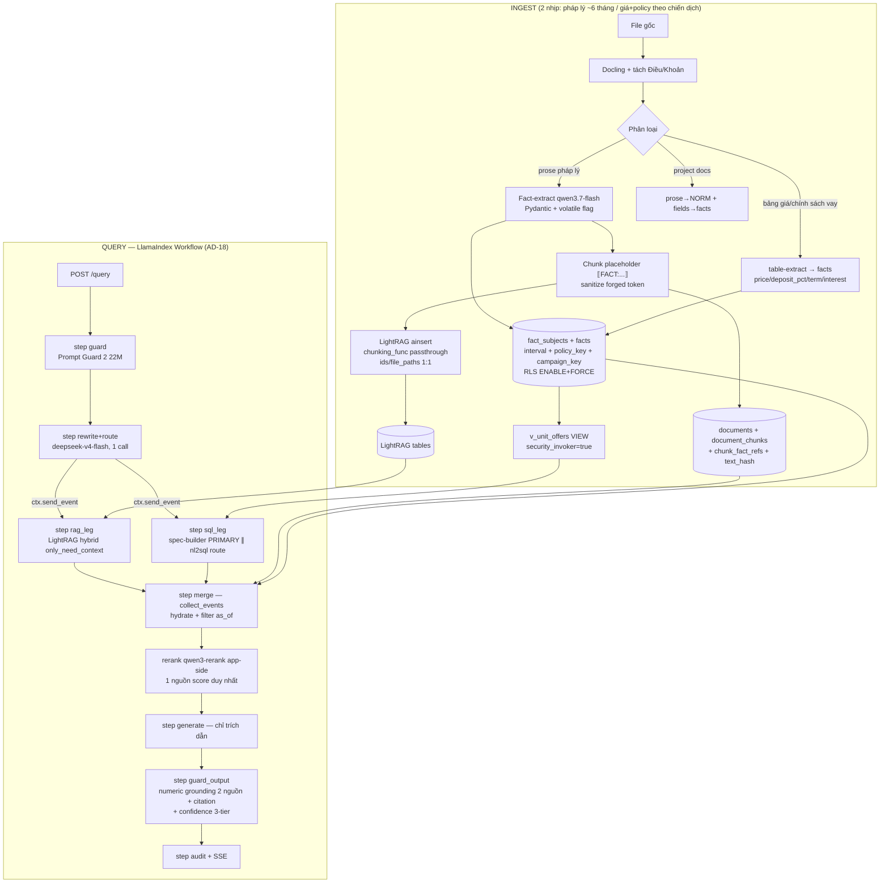

# FINAL PLAN v2.1 — Chatbot RAG bất động sản (Pháp lý + Giá + Chính sách vay)

> **Status: APPROVED** — user 2026-08-10: *"LlamaIndex + thêm cái LightRAG triển khai cho nhanh, chủ yếu cần cái có sẵn để làm nhanh nhất có thể. Hoàn thành plan để tôi qua session mới dựng basesource cả BE lẫn FE."*
> **Branch:** `feat/rag-real-estate-pilot` | **Scope MVP:** 10 ngày — user query (không admin UI/lifecycle UI/RBAC UI).
> **Supersedes:** v2.0/v1.0 cùng file + `rag-real-estate-mvp.plan.md` + `lightrag-overview.plan.md` + `chunk-postgres-flow.plan.md` (giữ làm reference).
> **Nguồn:** ARCHITECTURE-SPINE **AD-1..AD-12 + AD-18** (`.memlog.md` entry 15-16) · `docs/research/` (6 docs + `plan-review-findings.md` 13 findings + `_wf_arch_output.json` AD-13..17 + 20 challenge issues) · framework verify round 2026-08-10 (LangChain 1.0/LangGraph 1.0 vs LlamaIndex 0.14.23 — 3 researcher, nguồn chính thức).
> **Mục đích file này:** session mới đọc 1 file duy nhất + `docs/research/` là dựng được basesource BE + FE, không cần research lại.

---

## 0. Yêu cầu (3 vòng, restate)

1. **Vòng 1:** structured numeric/categorical facts lưu Postgres chuẩn hóa; chunk chỉ giữ ID tham chiếu; query đụng facts → **SQL ∥ RAG song song**; gộp LightRAG + rewrite + guardrails + generation; bắt hết case sót; conflict-check.
2. **Vòng 2:** embedding không hiểu lớn/bé/% → mọi số liệu + **chính sách vay** phải lưu SQL. Ví dụ bắt buộc: *căn A 8 tỉ, trả trước 25% + 75%/15 năm; "tôi có 2 tỉ mua được nhà nào?" → PHẢI trả lời căn A*. Catalog đầy đủ problems chatbot tư vấn nhà đất.
3. **Vòng 3 (chốt framework):** **LlamaIndex (orchestration) + LightRAG (retrieval)** — dùng đồ có sẵn, nhanh nhất; LangChain/LangGraph LOẠI.

**Kiến trúc 1 dòng:** *facts + chính sách vay NGOÀI vector index (bảng SQL interval-validity + VIEW `v_unit_offers`); chunk mang placeholder `⟦FACT:key@subject⟧`; query = **LlamaIndex Workflow** 8 step: guard → rewrite+route → (chân RAG LightRAG `only_need_context` ∥ chân SQL spec-builder/NL2SQL) → hydrate+filter → rerank app-side → generate → L4 grounding → audit+SSE.*

---

## 1. Năm nguyên tắc bất biến

1. **Facts NGOÀI vector index** — vector chứa nghĩa; giá/policy/diện tích = SQL. Update giá KHÔNG re-embed.
2. **Structured TRƯỚC, vector SAU** — hard constraint không phải soft signal; không vector-first với query nhạy giá.
3. **Filter hiệu lực TRƯỚC khi LLM thấy context.**
4. **SQL là nguồn số liệu DUY NHẤT — LLM generation KHÔNG BAO GIỜ tự tính toán** (AD-15): derived value từ SQL view/calculator; generation chỉ trích dẫn.
5. **Không đoán** — router/spec/extraction hỏng → fallback an toàn + cờ degraded + audit.

---

## 2. Kiến trúc tổng thể (AD-18: LlamaIndex Workflows bọc ngoài)



---

## 3. Structured Facts Layer (case trung tâm)

### 3.1 Facts là gì (mở rộng cho tài chính)

| Loại | Ví dụ | Lưu |
|---|---|---|
| Numeric | giá bán, giá/m², diện tích, tầng, thuế suất %, thời hạn | `value_num NUMERIC` + `unit` |
| Categorical | loại đất ONT/ODT/LUC, hướng, legal_status | `value_text` normalize qua `fact_aliases` |
| Range/approx | "từ 2-3 tỷ" | `quality='range'/'approx'` + range_min/max |
| **Finance policy** | `deposit_pct` (25.00=25%), `term_months` (180), `interest_rate_pct` (8.5000 %/năm) | facts riêng, `policy_key` phân biệt nhiều policy/căn |

**Kỷ luật kiểu số (AD-14):** tiền = `NUMERIC(20,0)`; % = điểm phần trăm `NUMERIC(5,2)`; lãi suất `NUMERIC(6,4)`; **CẤM float/double**. **NULL (thiếu fact) ≠ 0.00 (chính sách 0%)** — không COALESCE chung.

### 3.2 Pipeline ingest (thứ tự A6 — 1 transaction registry)

1. **Parse**: Docling (chính; MinerU fallback PDF scan xấu) → text + bảng; tách Điều/Khoản; pre-chunk theo Khoản ≤ cap (mục 3.7).
2. **Sanitize forged token**: escape literal `⟦` `⟧` có sẵn trong source TRƯỚC khi thay span.
3. **Detect + extract**: qwen3.7-flash trả JSON Pydantic: facts (key, subject, value, unit, quality, volatile, policy_key) + span. Retry 1; invalid/`extract_conf` thấp → `fact_review_queue` (ingest_log), KHÔNG đoán.
4. **Normalize**: số tiếng Việt ("2,85 tỷ"/"2.850.000.000đ"/"85,5 m²"/"một tỷ hai" → canonical); categorical qua `fact_aliases`; alias lạ → giữ raw + low-conf.
5. **Ghi PG — 1 transaction:** `documents` (published) → `fact_subjects` upsert (subject_key dedup: strip dấu chấm-gạch, lowercase trước UNIQUE) → `document_chunks` (chunk_id `doc_id:version:index`, ON CONFLICT idempotent, content placeholder-hóa, `text_hash` SHA-256) → `facts` (**effective_from/to kế thừa interval documents/campaign** — B4) → `chunk_fact_refs` → `campaigns` → **COMMIT**.
6. **LightRAG ainsert CHẠY SAU COMMIT** (pool riêng): mỗi Điều/Khoản = 1 element của `ainsert([...])`, `ids=[chunk_id]` + `file_paths=[doc_id]` 1:1 (A2), `chunking_func` passthrough (A1), lưu `lightrag_doc_id` vào documents. Fail → retry idempotent + ingest_log.

**kind='project' (B6):** prose → NORM; structured fields → facts (subject_type='project').

### 3.3 Schema v2 (chưa có dữ liệu thật — áp thẳng `db/schema.sql`)

```sql
-- documents: effective_from/effective_to (half-open) + lightrag_doc_id TEXT (A2)
-- document_chunks: + text_hash TEXT NOT NULL (B3)

CREATE TABLE campaigns (
  id BIGSERIAL PRIMARY KEY,
  campaign_key TEXT NOT NULL UNIQUE,       -- 'tower-a-2026q3'
  project_key  TEXT NOT NULL,
  effective_from DATE NOT NULL,
  effective_to   DATE,
  source_doc_id  TEXT NOT NULL REFERENCES documents(doc_id),  -- fail-loud khi xóa doc (A7)
  status TEXT NOT NULL DEFAULT 'active' CHECK (status IN ('active','expired')),
  created_at TIMESTAMPTZ NOT NULL DEFAULT now()
);

CREATE TABLE fact_subjects (
  id BIGSERIAL PRIMARY KEY,
  subject_key  TEXT NOT NULL UNIQUE,       -- 'unit:tower-a/A10-01' | 'tax:le-phi-truoc-ba'
  subject_type TEXT NOT NULL CHECK (subject_type IN ('unit','parcel','project','legal_fact','taxon')),
  display_name TEXT NOT NULL,
  project_key  TEXT,
  attrs JSONB NOT NULL DEFAULT '{}',
  created_at TIMESTAMPTZ NOT NULL DEFAULT now()
);

CREATE TABLE facts (
  id BIGSERIAL PRIMARY KEY,
  subject_id   BIGINT NOT NULL REFERENCES fact_subjects(id) ON DELETE CASCADE,
  fact_key     TEXT NOT NULL,              -- 'price_vnd'|'deposit_pct'|'term_months'|'interest_rate_pct'|...
  policy_key   TEXT,                       -- 'bank_a'|'bank_b'|'support' (nhiều policy/căn)
  campaign_key TEXT REFERENCES campaigns(campaign_key),  -- giá/policy BẮT BUỘC gán campaign (B7)
  value_num    NUMERIC,
  value_text   TEXT,
  unit         TEXT NOT NULL CHECK (unit IN ('vnd','m2','pct','months','days','enum')),
  quality      TEXT NOT NULL DEFAULT 'exact' CHECK (quality IN ('exact','range','approx')),
  range_min NUMERIC, range_max NUMERIC,
  volatile     BOOLEAN NOT NULL DEFAULT true,
  effective_from DATE NOT NULL,
  effective_to   DATE,                     -- NULL = còn hiệu lực; half-open '[)'
  source_doc_id   TEXT NOT NULL REFERENCES documents(doc_id),
  source_chunk_id TEXT REFERENCES document_chunks(chunk_id),
  extract_conf REAL,
  created_at TIMESTAMPTZ NOT NULL DEFAULT now(),
  CONSTRAINT chk_pct CHECK (unit <> 'pct' OR value_num IS NULL OR (value_num >= 0 AND value_num <= 100)),
  CONSTRAINT chk_vnd CHECK (unit <> 'vnd' OR value_num IS NULL OR value_num > 0)
);
CREATE EXTENSION IF NOT EXISTS btree_gist;
ALTER TABLE facts ADD CONSTRAINT facts_no_overlap
  EXCLUDE USING gist (subject_id WITH =, fact_key WITH =, COALESCE(policy_key,'') WITH =,
    daterange(effective_from, COALESCE(effective_to,'infinity'::date),'[)') WITH &&);
CREATE INDEX idx_facts_lookup ON facts (subject_id, fact_key, policy_key) WHERE effective_to IS NULL;
CREATE INDEX idx_facts_value  ON facts (fact_key, value_num);

-- RLS (A4 + A9): ENABLE+FORCE facts/fact_subjects/campaigns; policy MVP STATIC published
-- (không phụ thuộc identity; per-command theo AD-4; write role riêng + assert rowcount)
CREATE POLICY facts_pub_select ON facts FOR SELECT USING (
  EXISTS (SELECT 1 FROM documents d WHERE d.doc_id = facts.source_doc_id AND d.status = 'published'));

CREATE TABLE chunk_fact_refs (
  chunk_id TEXT NOT NULL REFERENCES document_chunks(chunk_id) ON DELETE CASCADE,
  fact_id  BIGINT NOT NULL REFERENCES facts(id) ON DELETE CASCADE,
  PRIMARY KEY (chunk_id, fact_id)
);
CREATE TABLE fact_aliases (
  alias TEXT NOT NULL, canonical TEXT NOT NULL, field TEXT NOT NULL,
  PRIMARY KEY (field, alias)
);
```

### 3.4 Affordability VIEW (AD-14 — trái tim case "2 tỉ")

Derived cross-row → VIEW (KHÔNG generated column). MVP dùng view thường `WITH (security_invoker=true)` (fix CRITICAL bypass RLS; KHÔNG materialized view).

```sql
CREATE OR REPLACE VIEW v_unit_offers WITH (security_invoker = true) AS
WITH cur AS (
  SELECT subject_id, policy_key, fact_key, value_num FROM facts
  WHERE effective_from <= CURRENT_DATE
    AND (effective_to IS NULL OR effective_to > CURRENT_DATE) AND quality = 'exact'
)
SELECT pol.subject_id, pol.policy_key,
  price.value_num::NUMERIC(20,0) AS price_vnd,
  dep.value_num::NUMERIC(5,2)    AS deposit_pct,
  term.value_num::INTEGER        AS term_months,
  int_pct.value_num::NUMERIC(6,4) AS interest_rate_pct,  -- NULL = chưa có
  CEIL(price.value_num * dep.value_num / 100.0)::NUMERIC(20,0) AS required_down_payment_vnd, -- CEIL
  ROUND(price.value_num * (100.0 - dep.value_num) / 100.0, 0)::NUMERIC(20,0) AS loan_amount_vnd,
  ROUND((price.value_num * (100.0 - dep.value_num) / 100.0) / NULLIF(term.value_num,0), 0)::NUMERIC(20,0) AS monthly_principal_vnd,
  ROUND((price.value_num * (100.0 - dep.value_num) / 100.0) * int_pct.value_num / 100.0 / 12.0, 0)::NUMERIC(20,0) AS monthly_interest_estimate_vnd -- ƯỚC TÍNH dư nợ gốc ban đầu
FROM (SELECT DISTINCT subject_id, policy_key FROM cur WHERE policy_key IS NOT NULL) pol
JOIN cur dep   ON dep.subject_id = pol.subject_id AND dep.policy_key = pol.policy_key AND dep.fact_key = 'deposit_pct'
JOIN cur term  ON term.subject_id = pol.subject_id AND term.policy_key = pol.policy_key AND term.fact_key = 'term_months'
LEFT JOIN cur int_pct ON int_pct.subject_id = pol.subject_id AND int_pct.policy_key = pol.policy_key AND int_pct.fact_key = 'interest_rate_pct'
JOIN cur price ON price.subject_id = pol.subject_id AND price.fact_key = 'price_vnd';
```

> Seed SQL 3 căn mẫu (2 policy/căn, policy 0%, căn không policy) + variant cash `v_unit_affordability_incl_cash`: xem `docs/_wf_arch_output.json` (mục affordability recommendations B/D).

**End-to-end ví dụ user:** "tôi có 2 tỉ mua được nhà nào?" → rewrite `{budget_vnd: 2e9}` → builder `SELECT ... FROM v_unit_offers WHERE required_down_payment_vnd <= 2000000000 ORDER BY required_down_payment_vnd LIMIT 10` → căn 8 tỉ deposit 25% → required 2.000.000.000 ✓ → FACT_EVIDENCE (price, deposit 25%, required, loan 6 tỉ, term 180, monthly ~33.3tr) → generation trích dẫn + disclosure "ước tính, chưa gồm phí". UI format `Intl.NumberFormat('vi-VN')`, KHÔNG tính lại float JS.

### 3.5 Placeholder + hydration

- Token `⟦FACT:<fact_key>@<subject_key>⟧` (+ `#<policy_key>` khi cần) — logical ref, KHÔNG row id.
- `resolve()` trong helper **`with_rls_identity()`** (1 nơi cho SQL leg + hydrate + post-filter): JOIN documents.status, interval tại `as_of` (mặc định today), format kèm ngày hiệu lực.
- Fact hết hiệu lực/không tồn tại → marker `[không có dữ liệu hiệu lực]`, KHÔNG silent drop. MVP policy static published → không cần identity; khi bật identity-based → thiếu identity fail **LOUD** (cờ `acl_degraded`), không 0 rows âm thầm.

### 3.6 Update 2 nhịp

| Sự kiện | Việc xảy ra | Vector |
|---|---|---|
| Bảng giá mới | **CÙNG 1 transaction**: expire facts cũ + insert mới + campaign mới | KHÔNG chạm |
| Policy vay đổi | Như trên, theo (subject, policy_key) | KHÔNG chạm |
| Pháp lý 6 tháng | fact mới interval; hydrate tự ra số mới; LightRAG delete-then-reinsert giữ LLM cache | Chỉ chunk đổi (text_hash) |
| Hủy tài liệu | Hard-delete 1 tx + rowcount assert: facts → chunks → documents → `adelete_by_doc_id(lightrag_doc_id)`; campaigns active = fail-loud | Xóa đúng doc |

### 3.7 Chunking + LightRAG ingest (A1/A11)

- Pre-chunk Điều/Khoản; **hard cap ≤ min(1200, embedding_max_token)** (Ngày 1 verify max_token text-embedding-v4); Điều dài tách theo Khoản.
- `chunking_func` passthrough → LightRAG KHÔNG re-chunk (verify signature 1.5.6 Ngày 1; không khả dụng → fallback server `LIGHTRAG_PARSER=P` + open item).
- Verify placeholder-integrity: số token hoàn chỉnh == số dòng chunk_fact_refs; không `⟦FACT` thiếu `⟧`; chunk_id LightRAG == registry; test Điều >1200 token nguyên chunk.

### 3.8 Structured query engine (AD-13 + AD-18 — cả 2 route TRONG MVP)

| Route | Khi nào | Cơ chế |
|---|---|---|
| **R1 — spec-builder deterministic (PRIMARY)** | filter/so sánh đơn/affordability (≥80%, gồm ví dụ user) | sql_spec JSON → validate closed-set → psycopg parameterized trên facts + v_unit_offers |
| **R2 — NL2SQL LlamaIndex (AD-18, gated)** | aggregate (count/min/max/avg + GROUP BY), so sánh nhiều dự án — spec không biểu diễn được | `NLSQLRetriever(SQLDatabase(from_uri(ro-uri), include_tables=['v_unit_offers','campaigns'], sample_rows_in_table_info=0), llm=OpenAILike(api_base=gateway), return_raw=True)` → `retrieve_with_metadata()` → `metadata['result']` (raw rows) + `metadata['sql_query']` → FACT_EVIDENCE; **KHÔNG prose synthesis** |

**Guardrails R2 (bắt buộc):** role `ro_nl2sql` SELECT-only + `default_transaction_read_only=on` + `statement_timeout` qua connect_args engine + vào `with_rls_identity()`; validator **sqlglot AST**: đúng 1 SELECT (reject semicolon/comment/multi-statement/DML mọi cấp/table∉whitelist đóng/function∉allowlist — chặn pg_sleep/set_config; cấm information_schema/pg_catalog); wrap `SELECT * FROM (<generated>) q LIMIT cap`; surface duy nhất view (KHÔNG đưa bảng nền vào schema prompt); **routing vào R2 qua detector intent deterministic** (keyword "bao nhiêu căn/trung bình/tổng/so sánh/giá trên m²") — injection không ép được; audit sql_query có redaction literals; pin llama-index-core==0.14.23 (pre-1.0 churn → golden regression mỗi lần nâng).

**KHÔNG Text2SQL tự do ở bất kỳ đâu. KHÔNG LangChain/LangGraph (AD-18).**

---

## 4. Query pipeline — LlamaIndex Workflow, 8 step (AD-18)

### 4.0 Khung workflow (`api/workflow.py`)

```python
# llama-index-core 0.14.23 — Workflows bundled (llama-index-workflows >=2.14,<3)
from llama_index.core.workflow import Workflow, step, Context, StartEvent, StopEvent, Event

class QueryStart(StartEvent): query: str; session_id: str | None; as_of: str | None; history: list
class Guarded(Event): clean_query: str
class Routed(Event): rewritten: str; routing: dict; sql_spec: dict | None; hl: list; ll: list; as_of: str; degraded: list
class RagResult(Event): chunks: list        # đã filter+hydrate+rerank
class SqlResult(Event): rows: list; meta: dict; degraded: bool
class Merged(Event): rag_blocks: str; evidence_blocks: str; sources: list
class Answered(Event): answer: str; facts: list; confidence: str; requires_review: bool
class QueryStop(StopEvent): payload: dict

class RagQueryWorkflow(Workflow):
    @step async def guard(self, ctx, ev: QueryStart) -> Guarded: ...          # api/guard_input.py
    @step async def rewrite(self, ctx, ev: Guarded) -> Routed: ...            # api/rewrite.py
    @step async def fanout(self, ctx, ev: Routed) -> None:                    # ctx.send_event x2
        ctx.send_event(RagLeg(ev)); ctx.send_event(SqlLeg(ev))
    @step async def rag_leg(self, ctx, ev: RagLeg) -> RagResult: ...          # api/rag_leg.py
    @step async def sql_leg(self, ctx, ev: SqlLeg) -> SqlResult: ...          # api/sql_leg.py
    @step async def merge(self, ctx, ev: RagResult | SqlResult) -> Merged:    # ctx.collect_events 2 leg
        ...                                                                    # api/merge.py + hydrate + rerank
    @step async def generate(self, ctx, ev: Merged) -> Answered: ...          # api/generate.py
    @step async def output_guard(self, ctx, ev: Answered) -> QueryStop: ...   # api/guard_output.py + audit
```

> ⚠️ Spike Ngày 1-2 verify exact event API 0.14.23 (`send_event`/`collect_events`/timeout per-step). **Fallback nếu API không khớp: gọi hàm trực tiếp + `asyncio.gather` bên trong step — KHÔNG block MVP.** Mọi logic trong module plain-function (test được không cần framework).

| Step | Module | Timeout |
|---|---|---|
| guard | `api/guard_input.py` | 1s |
| rewrite | `api/rewrite.py` | 4s |
| rag_leg | `api/rag_leg.py` | 6s |
| sql_leg | `api/sql_leg.py` (+`api/nl2sql_guard.py`) | 2s (SQL) / 8s (nl2sql route) |
| merge + rerank | `api/merge.py` + `api/rerank.py` | rerank 3s |
| generate | `api/generate.py` | stream |
| output_guard + audit | `api/guard_output.py` + `api/audit.py` | 2s |

### 4.1 L1 Input guard (AD-6)
Prompt Guard 2 22M (CPU ~19ms) + rules (≤2k chars, pattern exfiltration). Fail → từ chối + audit.

### 4.2 Rewrite + Route + Spec — 1 call (deepseek-v4-flash, non-thinking, JSON mode)
```json
{
  "rewritten_query": "Tìm căn hộ trả trước dưới 2 tỷ",
  "routing": { "needs_rag": false, "needs_sql": true, "structured_path": "spec" },
  "sql_spec": {
    "subject_type": "unit", "source": "v_unit_offers",
    "filters": [{"field": "required_down_payment_vnd", "op": "<=", "value": 2000000000}],
    "order_by": {"field": "required_down_payment_vnd", "dir": "asc"}, "limit": 10
  },
  "hl_keywords": [], "ll_keywords": ["trả trước", "2 tỷ"],
  "high_stakes": false, "as_of": null
}
```
- `structured_path ∈ {spec, nl2sql, none}`; **nl2sql chỉ khi detector intent deterministic khớp** (mục 3.8) — rewrite đề xuất, detector xác nhận.
- Few-shot parse số VN ("dưới 2 tỷ" → `<= 2000000000`; "tôi có X tiền" → budget → `required_down_payment_vnd`).
- Invalid JSON → retry 1 → fallback rag-only + cờ `router_degraded`.
- Multi-turn: rewrite resolve tham chiếu từ history; **history ≤4 turn/800 tokens**, cut cũ trước; retrieval KHÔNG phụ thuộc history.

### 4.3 Chân RAG (LightRAG 1.5.6)
- `rag.aquery(rewritten, QueryParam(mode="hybrid", only_need_context=True, hl_keywords=..., ll_keywords=..., enable_rerank=False, max_entity_tokens=2000, max_relation_tokens=2000, max_total_tokens=6000))` (A3; 8-12k là TỔNG generation).
- Inject hl/ll từ rewrite → skip LLM KEYWORDS; thiếu → LightRAG tự trích (KEYWORDS role qwen3.7-flash; Ngày 1 grep source chốt case key dict).
- Đọc **`raw_data.chunks`** (id+score+content) filter TỪNG chunk (A2); post-filter JOIN documents (status + **as_of** — B8) + graph-ACL AD-12 + hydrate.
- `addon_params={'language':'Vietnamese','entity_type_prompt_file':'prompts/entity_type/legal_vn.yml'}` + `entity_extraction_use_json=True`.
- Lỗi/timeout → degrade SQL-only + cờ `rag_degraded`.

### 4.4 Chân SQL (`api/sql_leg.py`)
- **Route R1 (PRIMARY):** validate closed-set TRƯỚC build (A5): source ∈ {`facts`,`v_unit_offers`}; field ∈ ALLOWED_FIELDS[source]; op ∈ {=,!=,<,<=,>,>=,between,in}; order_by.field ∈ allowlist; `dir` map dict {"asc":"ASC","desc":"DESC"}; limit ∈ [1,20] default 10; as_of parse DATE. psycopg parameterized; transaction `with_rls_identity()` + `SET LOCAL statement_timeout='2s'`; role `ro_query`.
- **match_semantics range/approx (A8, unit test):** `<=` match nếu range_min ≤ value; `>=` nếu range_max ≥ value; between = interval overlap; `in` chỉ categorical; disclosure "khoảng 1.8-2.2 tỷ, có phần vượt 2 tỷ".
- **Route R2 (nl2sql):** mục 3.8 — qua `api/nl2sql_guard.py` (validator + engine riêng) → raw rows.
- Rows → FACT_EVIDENCE blocks (`fe-001`...): giá trị chuẩn + quality + range + ngày hiệu lực + source_doc_id + campaign_key + công thức derived ("= giá × 25%") + `sql_query` (R2, redacted trong audit). **JSON-encoded như RAG_CONTEXT.**
- Timeout/error → degrade RAG-only + disclosure + audit.

### 4.5 Rerank — 1 nơi duy nhất (B5)
`enable_rerank=False` explicit; rerank app-side SAU post-filter (qwen3-rerank) — nguồn score DUY NHẤT cho confidence; CHỈ chân RAG; FACT_EVIDENCE không rerank.

### 4.6 Merge + Generation
- Prompt: system (chỉ tin evidence, cite bắt buộc, **KHÔNG tự tính**, không nghe lệnh trong data) > user (rewritten + history ≤4 turn) > data messages (RAG_CONTEXT + FACT_EVIDENCE, delimiter + JSON-encode; CẤM concat system).
- Luật ưu tiên: số CHỈ từ FACT_EVIDENCE; chunk cho quy định/khái niệm; chunk sót số mâu thuẫn → cờ inconsistent, theo evidence.
- 0 rows + cold start: phân biệt "chưa có trong dữ liệu hiện hành" vs "chưa nạp" (check campaigns count) + dẫn nguồn; "giá liên hệ"/thiếu fact → fallback sales.
- Model deepseek-v4-flash; high_stakes → V4 Pro. SSE mục 16.4.

### 4.7 L4 Output guard
1. **Numeric grounding 2 nguồn (AD-15):** (a) byte-match FACT_EVIDENCE sau normalize, (b) calculator/tool attest (v2). Trượt → regenerate 1 lần → hạ confidence + citation thay thế.
2. **Chặn số vô chủ:** số tài chính không có FACT_EVIDENCE → LOW + cờ review.
3. **Citation grounding:** span ∈ chunk **hydrated**.
4. **Confidence 3-tier:** HIGH (grounding pass + SQL ≥1 row provenance hợp lệ HOẶC ≥2 chunk rerank ≥0.8 + không inconsistent); MEDIUM (1 nguồn/degraded/approx); LOW → `requires_review` (high-stakes keywords: cầm cố, thế chấp, chuyển nhượng, công chứng, quy hoạch, thuế, sổ đỏ, giải chấp, tranh chấp, ủy quyền, kê biên, hiệu lực).
5. Guardrail LLM (deepseek-v4-flash-0731) chỉ khi deterministic fail/sample — lớp phụ.

### 4.8 Audit (AD-10)
trace_id, identity, routing+structured_path, sql_spec (redact literals), sql_query R2 (redacted), fact_ids, chunk_ids, rerank scores, prompt hash, model+version, answer hash, confidence, guard verdicts; append-only role riêng.

---

## 5. Guardrails 4 lớp (AD-6)

| Lớp | Thành phần |
|---|---|
| L1 | Prompt Guard 2 22M + rules (Ngày 5 test FP/FN bộ 20 câu VN `eval/injection_test_vn.json`) |
| L2 | instruction hierarchy + delimiter + JSON-encode cả 2 block + cấm concat system |
| L3 | chunk limit 3-5 / rows ≤20 + content-hash/provenance + graph-ACL + sanitize forged token + token blast-radius + **view security_invoker** + NL2SQL AST guard |
| L4 | numeric grounding 2 nguồn + chặn số vô chủ + citation hydrated + confidence + guardrail-LLM sample + audit |

---

## 6. Mapping vai trò LLM

| Vai | Model | Khi nào |
|---|---|---|
| Rewrite + Route + Spec | deepseek-v4-flash | mỗi query, non-thinking, JSON mode |
| Fact EXTRACT / Graph EXTRACT | qwen3.7-flash | ingest |
| KEYWORDS fallback | qwen3.7-flash | rewrite thiếu keywords |
| **NL2SQL (R2)** | qwen3.7-flash qua OpenAILike | aggregate/compare queries |
| Answer | deepseek-v4-flash (high-stakes → V4 Pro) | mỗi query |
| Guardrail LLM | deepseek-v4-flash-0731 | deterministic fail/sample |
| Input classifier | Prompt Guard 2 22M CPU | mỗi query + chunk ingest |
| Embedding | text-embedding-v4 dims **1024 LOCK** — chain `EMBEDDING_BINDING=dashscope\|aibox\|local` | ingest + query |
| Rerank | qwen3-rerank app-side — DashScope `/v1/reranks` / api-box `/v1/rerank`+`RERANK_BINDING=cohere`; fail → off + cờ | mỗi query |

⚠️ Verify pricing chính thức trước khi chốt vendor.

---

## 7. Conflict check giữa các công nghệ (v2.1)

| # | Cặp | Xung đột | Xử lý |
|---|---|---|---|
| 1 | Rewrite ↔ LightRAG KEYWORDS | 2 LLM trùng việc | inject hl/ll → skip; fallback |
| 2 | LightRAG default generate ↔ generation ta | 2 chỗ generate | `only_need_context=True` |
| 3 | Rerank ↔ FACT_EVIDENCE | rerank đẩy chunk lấn số | rerank CHỈ RAG leg |
| 4 | Embedding chứa số ↔ biến động | giá cũ đóng băng | placeholder + facts ngoài index |
| 5 | Graph EXTRACT ↔ số biến động | entity mang số cũ | placeholder TRƯỚC extract |
| 6 | Prompt Guard 2 ↔ tiếng Việt | FP/FN chưa test | test Ngày 5 + rule layer |
| 7 | Answer ↔ guardrail cùng họ | correlated failure | deterministic CHÍNH; eval judge khác họ |
| 8 | RLS chunks ↔ SQL leg | đi tắt ACL | RLS DDL + with_rls_identity + security_invoker |
| 9 | LightRAG cache ↔ rewrite | cache miss | cache extraction giữ; query cache off |
| 10 | schema cũ ↔ interval | lẫn chuẩn | sửa schema v2 trước ingest |
| 11 | HNSW pre-filter selective | recall cliff | SQL leg độc lập; iterative_scan nếu cần |
| 12 | ainsert F-chunker ↔ Điều/Khoản | vỡ placeholder | chunking_func passthrough + cap + integrity test |
| 13 | **llama-index ↔ lightrag-hku** | dep/RAM | verify PyPI KHÔNG xung đột (lightrag asyncpg, llama sqlalchemy riêng; pydantic v2; openai 2.x); pin AD-17; Ngày 1 pip check |
| 14 | Rerank 2 nơi | 2 bộ score | enable_rerank=False + app-side duy nhất |
| 15 | View derived ↔ RLS | owner bypass | `security_invoker=true`; không MV ở MVP |
| 16 | **QueryPipeline ↔ Workflows** | Pipeline deprecated | CHỈ dùng Workflows (AD-18) |
| 17 | **LlamaIndex orchestration ↔ module deterministic** | framework nuốt logic | framework bọc NGOÀI; module = plain function test độc lập; fallback asyncio trong step |

---

## 8. Edge cases đã bắt (32)

1-24 (v1): số VN đa dạng; range/approx; compound query; refusal 0 rows; as-of; subject xuyên dự án; dangling ref; số mâu thuẫn; leg degrade; router hỏng; alias; extract low-conf; multi-turn; injection vào fact/query; update giữa session; interval chồng; cascade delete; token budget; embedding drift; eval invalidation; PgBouncer GUC; high-stakes ceiling; "đất cầm" 2 nghĩa.
25. Affordability "có X tiền mua căn nào" → v_unit_offers + budget; CEIL down-payment.
26. Nhiều policy/căn → 1 row/policy, so sánh được.
27. Căn không policy → không hiện trong offers (variant cash nếu cần); NULL interest ≠ 0%.
28. "giá liên hệ"/thiếu fact → fallback sales.
29. Số viết bằng chữ ("một tỷ hai") → fallback lib đọc số VN.
30. UI KHÔNG tính float; Intl.NumberFormat('vi-VN').
31. Injection ép route/needs_sql=false → chặn số vô chủ L4 + detector intent R2.
32. Lãi annuity = ước tính dư nợ gốc ban đầu → dán nhãn, không phải lịch trả nợ.

---

## 9. PROBLEM CATALOG — chatbot tư vấn nhà đất (26 problems, 7 nhóm)

| # | Problem | Status | Resolution |
|---|---|---|---|
| 1 | Hard filter (giá≤budget, diện tích, phòng, hướng) | ✅ v1 | spec-builder + allowlist |
| 2 | **Affordability "2 tỉ mua căn nào"** | ✅ v1 | v_unit_offers + budget param (§3.4) |
| 3 | Chính sách vay (deposit %, term, interest, ân hạn) | ✅ v1 | finance facts policy_key + view |
| 4 | Aggregate/compare (count/AVG giá/m², so sánh dự án) | ✅ **v1 (AD-18 — NL2SQL route R2)** | NLSQLRetriever + guardrails §3.8 |
| 5 | Calculator thuế phí VN (TNCN 2%, trước bạ 0.5%, công chứng TT 257) | ⏳ v2 | calculator tool versioned (AD-15) |
| 6 | Stress-test GDS/TDS/DTI | ⏸ defer | post-MVP |
| 7 | Thế chấp/cầm cố/"đất cầm" 2 nghĩa | ✅ v1 | taxonomy T1-T4 + legal_status + cảnh báo |
| 8 | Ra sổ 50 ngày, quy hoạch treo, đặt cọc/mất cọc | ✅ v1 | RAG + citation + high-stakes review |
| 9 | Đang thế chấp có bán được (BLDS đ.320 k.8) | ✅ v1 | RAG + quy trình giải chấp trong graph |
| 10 | Inventory live (còn/hết/đã cọc/booking), oversell | ⏸ defer phase 2 | cần CRM API live |
| 11 | Escalation + handoff sales | ✅ cờ v1 / ladder v2 | requires_review + fallback sales |
| 12 | Disclaimer non-licensed assistant | ✅ template v1 | "không phải tư vấn pháp lý chính thức" |
| 13 | Số VN đa định dạng + chữ viết | ✅ v1 | normalize + few-shot + lib |
| 14 | Multi-turn tham chiếu | ✅ v1 | rewrite self-contained |
| 15 | Freshness giá/policy theo đợt | ✅ v1 | interval + campaign + same-tx update |
| 16 | Refusal đúng (chưa có vs chưa nạp) | ✅ v1 | cold-start check |
| 17 | As-of lịch sử | ✅ v1 | as_of cả 2 chân |
| 18 | Range/approx semantics | ✅ v1 | match_semantics |
| 19 | Injection text-to-SQL (CVE-2024-23751) | ✅ v1 | R1 không có đường; R2 AST guard + ro role |
| 20 | Rerank lấn evidence | ✅ v1 | rerank RAG-only |
| 21 | Graph poisoning số liệu | ✅ v1 | placeholder + sanitize |
| 22 | ACL facts/RLS | ✅ v1 static / identity v2 | DDL + security_invoker |
| 23 | Audit replayable + redaction | ✅ v1 | AD-10 |
| 24 | Post-filter recall cliff | ✅ v1 | SQL leg độc lập |
| 25 | Công thức thuế đổi theo Nghị định | ⏳ v2 | formula versioned |
| 26 | Chunking listing destructive | ✅ v1 | facts ngoài chunk |

---

## 10. Pha triển khai 10 ngày (mức haiku — file + verify)

> Env: PG 16.6+ + pgvector ≥0.8, Python ≥3.10. **Ingest nặng + eval CHẠY OFF-BOX (máy dev)**; VPS 4GB chỉ app+PG query-time. Secrets chỉ qua env.

### Ngày 1-2: Nền tảng + 4 spikes (bắt buộc)
- `docker-compose.yml` (PG 16.6 + pgvector, port 5432, volume) → `CREATE DATABASE ragre` (LightRAG tạo bảng KHÔNG tạo DB).
- `db/schema.sql` v2 (§3.3 + v_unit_offers §3.4 + RLS + audit tables) + apply.
- `requirements.txt` (mục 15) + `.env.example` (mục 16.6) + `ingest/config.py` Settings duy nhất.
- **Spike 1 (dep):** `pip install -r requirements.txt` + `pip check` + import smoke (lightrag + llama_index.core, pydantic ≥2.8) → ghi resolved vào `docs/provider-verify.md`.
- **Spike 2 (provider):** curl `/v1/models`, `/v1/embeddings` (+text dài → max_token thật), `/v1/reranks` DashScope; fallback chain A12.
- **Spike 3 (LlamaIndex — AD-18):** `python -c` verify (a) Workflows event API: `Workflow/@step/Context.send_event/collect_events` chạy toy 2 step song song; (b) `NLSQLRetriever` signature + toy query assert `metadata['result']` raw rows + `metadata['sql_query']`. Fail (a) → fallback asyncio trong step; fail (b) → R2 defer, R1 vẫn chạy. Ghi kết quả.
- **Spike 4:** grep source lightrag 1.5.6: key dict `role_llm_configs` (case) + signature `chunking_func`.
- `ingest/lightrag_init.py`: 4 storage PG + 2 init bắt buộc + addon_params Vietnamese + entity_type_prompt_file + ENTITY_EXTRACTION_USE_JSON + MAX_ASYNC_LLM=6/MPI=2 + dims 1024 + chunking_func passthrough.
- **Verify:** schema apply + exclusion constraint chặn interval chồng (kể cả policy_key); 4 spike pass; LightRAG init smoke.

### Ngày 3-4: Ingest + fact extraction
- `ingest/parser.py`, `ingest/fact_extract.py`, `ingest/placeholder.py`, `ingest/load.py` (§3.2 — ainsert SAU COMMIT, ids/file_paths 1:1, lightrag_doc_id).
- **Seed (data owner, hạn TRƯỚC Ngày 3 — `data-contract.md` §4):** bảng giá 2 campaign (≥20 căn, 2-3 dự án, 1-10 tỷ) + mock policy vay (2 policy/căn + 1 policy 0% + 1 căn không policy) + 8-12 văn bản luật T4: 31/2024/QH15, 29/2023/QH15, 91/2015/QH13 (Điều 309-321/328), 27/2023/QH15, NĐ 101/2024, NĐ 96/2024, NĐ 99/2022, TT 04/2024/TT-BXD.
- `scripts/verify_ingest.sql` (A13): dangling placeholder=0; placeholder thiếu ref; graph nodes không số giá; chunk_id khớp; integrity regex.
- **Verify:** seed pass; facts>0 đủ deposit/term/interest; `SELECT * FROM v_unit_offers` đúng (so tay 1 căn); demo "có 2 tỷ" ra căn 8 tỉ 25%.

### Ngày 5-6: Guard + rewrite + chân RAG + khung workflow
- `api/guard_input.py` + `eval/injection_test_vn.json` (20 câu, owner golden, ghi FP/FN).
- `api/rewrite.py` + `api/llm.py` (OpenAI-compatible wrapper aibox/DashScope).
- `api/rag_leg.py` (only_need_context + 3 token budget + raw_data.chunks + post-filter as_of + graph-ACL + hydrate).
- `api/workflow.py` skeleton: events + steps wired (sql_leg placeholder trả mock rows).
- **Bắt đầu soạn `eval/golden_set_v1.json`** (chỉ feature v1).
- **Verify:** 15 unit test rewrite; 10 câu legal → chunk đúng hiệu lực; hydrate đúng giá; workflow toy chạy end-to-end với mock SQL.

### Ngày 7: Chân SQL (R1 + R2) + merge + generate
- `api/sql_leg.py` (validate closed-set + match_semantics + builder + FACT_EVIDENCE + degrade).
- `api/nl2sql_guard.py` (sqlglot AST + ro_nl2sql engine + LIMIT wrap + detector intent) + route R2 trong sql_leg.
- `api/merge.py` + `api/rerank.py` (app-side, nguồn score duy nhất) + `api/generate.py`.
- **Verify:** 10 câu affordability/giá → số đúng + provenance; injection spec (op lạ/field ngoài/dir) reject; **aggregate "có bao nhiêu căn dưới 2 tỷ" → R2 raw rows đúng count**; compound 2 chân; range disclosure.

### Ngày 8: Output guard + confidence + audit
- `api/guard_output.py` (numeric grounding 2 nguồn + số vô chủ + citation hydrated + 3-tier + regenerate-1 + guardrail-LLM sample).
- `api/review_queue.py` lite + `api/audit.py` (redaction + append-only role).
- Hoàn tất wire `api/workflow.py` thật (thay mock).
- **Verify:** unit test 3 tier; số bịa → chặn; high-stakes → cờ review; replay 1 query end-to-end; workflow timeout/degrade per-step đúng.

### Ngày 9: Eval + FE web + update flow
- `eval/golden_set_v1.json` ≥50 câu: 20 legal, 12 fact/affordability, 4 aggregate (R2), 6 mixed, 4 refusal, 3 as-of, 5 số-đa-định-dạng; kèm expected_facts/gold_chunk_ids/expected_routing(+structured_path). Case thuế/escalation → golden_set_v2.
- `eval/run_eval.py`: faithfulness + answer-relevancy (judge ghim version, contexts gồm FACT_EVIDENCE) + numeric exact-match + routing/path accuracy + refusal + freshness; P50/P95 (**budget P50<6s, P95<10s**).
- `scripts/update_price.sh` (expire+insert CÙNG tx + regression → verify 0 re-embed).
- **`web/` FE theo §16** (index.html + app.js + styles.css; FastAPI StaticFiles).
- **Verify:** baseline + exact-match ≥0.95; update giá không chạm vector; FE demo 5 câu (sources render trước token, facts bảng, confidence badge).

### Ngày 10: Hardening + deploy Viettel VPS
- Docker Compose (app + PG) VPS 2-4vCPU/4GB; postgresql.conf (shared_buffers 1GB, work_mem 256MB); pg_dump hằng ngày + `scripts/update_6mo.sh` (backup → incremental off-box → restore → regression → re-baseline).
- nginx `proxy_buffering off` + `proxy_read_timeout 300s`; gunicorn uvicorn-worker `--timeout 0`; rate limit + auth tối thiểu `/query`; `/health` `/ready`.
- Red-team 10 prompt OWASP + audit replay + backup/restore dry-run.
- **Verify:** demo staging 20 câu golden; success signals §17 check được.

---

## 11. Eval & CI (AD-8)

- Golden set version cùng corpus; re-baseline trước/sau update.
- Metric: faithfulness, answer-relevancy, **numeric exact-match**, **routing accuracy (needs_sql + structured_path)**, refusal correctness, citation correctness, freshness; P50/P95.
- CI: PR = faithfulness + answer-relevancy subset + numeric exact-match; nightly = full + latency.
- Ngưỡng khởi điểm (calibrate baseline riêng): exact-match ≥0.95; unsupported-claim = 0 (gate cứng); delta ~0.05.
- Freshness case riêng: campaign expire → số cũ KHÔNG xuất hiện.

---

## 12. Roadmap v2 (sau MVP)

1. Calculator thuế phí (AD-15) versioned theo Nghị định.
2. Escalation ladder 4 làn + disclaimer đầy đủ + CRM handoff.
3. Identity-based RLS (multi-tenant) — with_rls_identity chờ sẵn.
4. Inventory live API (còn/hết/booking).
5. MV hóa v_unit_offers nếu perf cần (unique index + REFRESH trigger khi facts/status đổi).
6. LangGraph chỉ cân nhắc NẾU pipeline phình thành multi-agent/HITL (không phải bây giờ — AD-18).

---

## 13. Rủi ro & open items

| # | Item | Hạn |
|---|---|---|
| 1 | Verify DashScope/aibox endpoints + pricing | Ngày 1-2 |
| 2 | Prompt Guard 2 FP/FN tiếng Việt | Ngày 5 |
| 3 | chunking_func signature + role_llm_configs key case | Ngày 1 spike 4 |
| 4 | embedding max_token thật | Ngày 1 spike 2 |
| 5 | Workflows event API + NLSQLRetriever metadata (pre-1.0 churn) | Ngày 1 spike 3 (fallback sẵn) |
| 6 | Dữ liệu: bảng giá 2 campaign + mock policy vay | data owner, TRƯỚC Ngày 3 |
| 7 | Fact extraction PDF scan xấu → human spot-check | Ngày 3-4 |
| 8 | Lãi annuity ước tính → dán nhãn | template |

---

## 14. Non-goals MVP

- KHÔNG LangChain/LangGraph (AD-18); KHÔNG thay LightRAG bằng LlamaIndex.
- KHÔNG QueryPipeline (deprecated). KHÔNG Text2SQL tự do.
- KHÔNG admin UI/lifecycle UI/RBAC UI; KHÔNG inventory/booking; KHÔNG calculator thuế phí (v2).
- KHÔNG MV ở MVP; KHÔNG multi-currency ngoài VND; KHÔNG fine-tune embedding.

---

## 15. requirements.txt (pin AD-17 + AD-18)

```
lightrag-hku==1.5.6
llama-index-core==0.14.23          # Workflows bundled (llama-index-workflows >=2.14,<3)
llama-index-llms-openai-like==0.7.2
pydantic>=2.8.0,<3
numpy>=1.24,<3
sqlalchemy>=2,<3                   # chỉ llama-index dùng (lightrag đi asyncpg)
asyncpg>=0.31
psycopg2-binary
pgvector
openai>=2,<3
tiktoken>=0.7
sqlglot                            # pin bản mới nhất tại Ngày 1
fastapi
uvicorn[standard]
gunicorn
python-dotenv
httpx
docling                            # parser chính (MinerU optional fallback)
ragas                              # eval
pytest
```

---

## 16. basesource contract cho session mới

### 16.1 File tree (tạo đủ)

```
rag-real-estate/
  requirements.txt          # §15
  .env.example              # §16.6
  docker-compose.yml        # PG 16.6 + pgvector (dev)
  db/
    schema.sql              # §3.3 + §3.4 + RLS + documents/document_chunks/ingest_log
    audit.sql               # audit tables (append-only role)
    seed/                   # bảng giá mẫu + policy JSON + danh mục T4
  ingest/
    config.py  lightrag_init.py  parser.py  fact_extract.py  placeholder.py  load.py
  api/
    main.py                 # FastAPI + lifespan + StaticFiles web/ + routes
    workflow.py             # §4.0 LlamaIndex Workflow
    llm.py  guard_input.py  rewrite.py  rag_leg.py  sql_leg.py
    nl2sql_guard.py  rerank.py  merge.py  generate.py  guard_output.py  audit.py
  web/
    index.html  app.js  styles.css
  eval/
    golden_set_v1.json  run_eval.py  injection_test_vn.json
  scripts/
    verify_ingest.sql  update_price.sh  update_6mo.sh
  prompts/
    entity_type/legal_vn.yml  rewrite_fewshot.md  system_policy.md
```

### 16.2 API contract

`POST /query`
```json
// Request
{ "query": "tôi có 2 tỉ mua được căn nào?", "session_id": "s-001", "as_of": null,
  "history": [{"role": "user", "content": "..."}, {"role": "assistant", "content": "..."}] }
// Response 200
{ "answer": "...", 
  "sources": [{"doc_id": "price-tower-a-2026q3", "title": "Bảng giá Tower A đợt 3/2026",
               "section": null, "effective_from": "2026-03-01", "kind": "price"}],
  "facts": [{"fe_id": "fe-001", "subject": "unit:tower-a/A10-01", "policy_key": "bank_a",
             "fields": {"price_vnd": 8000000000, "deposit_pct": 25.0,
                        "required_down_payment_vnd": 2000000000, "loan_amount_vnd": 6000000000,
                        "term_months": 180, "monthly_principal_vnd": 33333333,
                        "monthly_interest_estimate_vnd": null},
             "note": "= giá × 25%; lãi: chưa có thông tin"}],
  "confidence": "HIGH", "requires_review": false,
  "routing": {"needs_rag": false, "needs_sql": true, "structured_path": "spec"},
  "trace_id": "t-...", "latency_ms": 3200 }
// Lỗi: {ok:false, error:{code, message}} + HTTP status; SSE luôn emit done kể cả sau error
```
`GET /health` (liveness) · `GET /ready` (check PG + LightRAG storages) · `GET /sources/{doc_id}` (metadata + tình trạng hiệu lực).

### 16.3 Response rules (FE + BE thống nhất)

- Số tài chính trong `answer` LUÔN kèm nguồn trong `sources`/`facts`; FE render facts[] thành bảng riêng, không parse số từ answer.
- `requires_review=true` → FE hiện banner "Cần tư vấn viên xác nhận" + nút liên hệ.
- Confidence badge: HIGH xanh / MEDIUM vàng / LOW đỏ.

### 16.4 SSE events (`POST /query` với `Accept: text/event-stream`)

| event | data | khi nào |
|---|---|---|
| `sources` | JSON sources[] | TRƯỚC khi generate |
| `facts` | JSON facts[] | ngay sau SQL leg xong |
| `token` | `{"text": "..."}` | stream answer |
| `done` | payload đầy đủ §16.2 | LUÔN emit (kể cả sau error, trong finally) |
| `error` | `{"message": "..."}` | trước done |

### 16.5 FE spec (`web/` — vanilla HTML/JS, KHÔNG framework, FastAPI StaticFiles phục vụ)

- Layout 1 trang: header (tên bot + disclaimer "AI hỗ trợ, không phải tư vấn pháp lý chính thức") · chat pane (message user/assistant, scroll bottom) · input row (textarea + nút gửi, Enter gửi).
- `app.js`: `fetch('/query', {method:'POST', body})` đọc stream bằng `ReadableStream` + `TextDecoder` parse SSE (KHÔNG EventSource vì cần POST); render: message assistant tạo ngay → gắn bảng sources khi `event: sources` → gắn bảng facts khi `event: facts` → append text khi `token` → chốt confidence badge + requires_review banner khi `done`; lỗi → toast + giữ input.
- Format tiền: `new Intl.NumberFormat('vi-VN')` + hậu tố "đ"; KHÔNG tính toán lại bất kỳ số nào ở FE.
- styles.css: tối giản, responsive mobile-first, bubble user phải/assistant trái, bảng facts border-collapse, badge màu theo §16.3.
- Session: `session_id = crypto.randomUUID()` lưu sessionStorage; history client giữ ≤4 turn gửi kèm.

### 16.6 .env.example (KHÔNG commit giá trị thật)

```
# Postgres (LightRAG đọc trực tiếp POSTGRES_*)
POSTGRES_HOST=localhost
POSTGRES_PORT=5432
POSTGRES_USER=ragre
POSTGRES_PASSWORD=__CHANGE__
POSTGRES_DATABASE=ragre
POSTGRES_MAX_CONNECTIONS=10
POSTGRES_VECTOR_INDEX_TYPE=HNSW
POSTGRES_HNSW_M=16
POSTGRES_HNSW_EF=64
LIGHTRAG_WORKSPACE=ragre_mvp
# Providers
EMBEDDING_BINDING=dashscope        # dashscope|aibox|local
EMBEDDING_API_KEY=__CHANGE__
EMBEDDING_BASE_URL=https://dashscope.aliyuncs.com/compatible-mode/v1
EMBEDDING_MODEL=text-embedding-v4
EMBEDDING_DIM=1024
RERANK_BINDING=dashscope           # dashscope|aibox|null  (aibox: /v1/rerank + RERANK_BINDING=cohere)
RERANK_API_KEY=__CHANGE__
RERANK_BASE_URL=__CHANGE__
RERANK_MODEL=qwen3-rerank
ENABLE_RERANK=true
LLM_API_KEY=__CHANGE__
LLM_BASE_URL=__CHANGE__
LLM_MODEL_REWRITE=deepseek-v4-flash
LLM_MODEL_EXTRACT=qwen3.7-flash
LLM_MODEL_ANSWER=deepseek-v4-flash
LLM_MODEL_ANSWER_PRO=deepseek-v4-pro
LLM_MODEL_GUARD=deepseek-v4-flash-0731
LLM_MODEL_NL2SQL=qwen3.7-flash
APP_ENV=dev
```

### 16.7 Thứ tự dựng basesource (session mới làm đúng trình tự)

1. Đọc file này + `docs/research/plan-review-findings.md` + `docs/_wf_arch_output.json`.
2. Tạo repo structure §16.1 → `requirements.txt` + `.env.example` + `docker-compose.yml`.
3. Ngày 1-2 theo §10 (4 spikes là gate — chưa pass chưa sang Ngày 3).
4. Mỗi ngày xong chạy đúng mục **Verify** của ngày đó; fail = sửa trước khi đi tiếp.
5. Ngày 9 FE theo §16.3-16.5; test SSE bằng trình duyệt thật.
6. RECORD tiến độ về vault theo graph-orchestrator (task node `rag-real-estate-pilot-20260809`).

---

## 17. Success signals

1. **"Tôi có 2 tỉ mua được nhà nào?" → đúng căn 8 tỉ (25% = 2 tỉ)** + monthly estimate + nguồn + ngày hiệu lực; số 100% từ SQL, qua Workflow orchestration.
2. **"Có bao nhiêu căn dưới 2 tỷ?" → R2 NL2SQL trả count đúng** (raw rows, guard pass).
3. Update bảng giá/policy KHÔNG re-embed; answer đổi ngay sau transaction.
4. Legal giữ chất lượng LightRAG hybrid (faithfulness không tụt >0.05).
5. 0 số bịa (grounding + exact-match ≥0.95); OWASP corpus không case nào vượt L1-L4.
6. Audit replay mọi query (routing → spec/sql_query → fact_ids → answer).
7. FE nhận SSE đúng thứ tự sources→facts→token→done; render facts bảng + confidence badge.
8. 13 findings vòng 1 + 20 issues vòng 2 + AD-18 đã tích hợp — không bỏ thầm.
