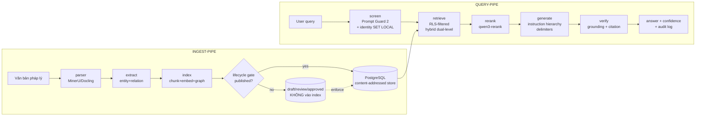

# Architecture Spine — rag-real-estate (RAG pháp lý bất động sản)

## Design Paradigm

**Pipes-and-filters** — hai filter chain (ingest-gate / query-gate) chạy trên **một content-addressed PostgreSQL store**. Mỗi chunk là dữ liệu bất biến (content-hash + ID ổn định) mang metadata lifecycle + ACL; các bộ lọc là điểm ENFORCE (không phải lời khuyên): ingest pipe kết thúc ở **publish gate** (chỉ `published` vào live index), query pipe bắt đầu bằng **screen** (injection + identity) và kết thúc bằng **verify** (grounding + citation). Security boundary nằm ở retrieval-time (trong DB), không ở UI hay LLM output.



## Invariants & Rules

### AD-1 — Single PostgreSQL backend (mọi storage)

- **Binds:** ingest, query, storage
- **Prevents:** chạy 2-3 service (vector DB riêng, KV riêng, graph DB riêng) → drift + backup phức tạp
- **Rule:** Mọi state (KV, vector, graph, doc-status) nằm trong 1 PG: `PGKVStorage` + `PGVectorStorage` + `PGTableGraphStorage` (plain PG tables JSONB — KHÔNG Apache AGE, KHÔNG NetworkX cho ops trong production) + bảng `documents`/`chunks` riêng. Neo4j/Memgraph chỉ khi >10k docs — khi đó vẫn giữ PG làm source of record.

### AD-2 — Embedding model LOCK

- **Binds:** ingest, retrieval
- **Prevents:** đổi model giữa chừng → trộn vector 2 chiều không gian khác nhau = khoảng cách vô nghĩa
- **Rule:** `aibox text-embedding-v4` dims **1024** từ env (`AIBOX_MODEL`), config tập trung 1 nơi. Đổi model = **full re-embed toàn bộ** (AD-7), không bao giờ incremental; version embedding per row (`model_name`, `model_version`, `is_current`).

### AD-3 — Document lifecycle state machine

- **Binds:** ingest, retrieval, documents
- **Prevents:** "policy doc update nhưng bản cũ vẫn nằm trong index cạnh bản mới" — failure mode kinh điển của RAG enterprise
- **Rule:** `documents.status ∈ {draft, review, approved, published, deprecated, deleted}`. Transition: draft→review→approved→**published** (publish = hành động RIÊNG, chỉ `published` mới vào live vector index). **Sau khi `approved`: snapshot-lock metadata (kể cả `acl_roles`) — không edit trực tiếp, phải tạo draft version mới** (chống đổi ACL sau sign-off). `deprecated` → loại khỏi retrieval (post-filter `effective_date`/`status` + RLS), CHỈ ẩn UI là không đủ. `deleted` → **cascade delete** chunks + embeddings + graph nodes + cached responses + deletion log.

### AD-4 — Retrieval-time ACL = PostgreSQL Row-Level Security

- **Binds:** retrieval, query, documents
- **Prevents:** LLM output hiển thị doc không được phép → compliance failure phổ biến nhất enterprise RAG
- **Rule:** Chunk tables bật `ENABLE ROW LEVEL SECURITY` + `FORCE RLS`; runtime role `NOSUPERUSER` + `NOBYPASSRLS`; identity từ `SET LOCAL app.user_id` (tham số `true`, chết cuối transaction); **không bao giờ** lấy identity từ client-supplied header. **RLS policy theo từng command** (SELECT/DELETE dùng `USING`, INSERT/UPDATE dùng `WITH CHECK` — vì `USING` cũng chặn DELETE/UPDATE, replace-mode delete của AD-7 chạy dưới role không khớp `acl_roles` sẽ âm thầm xóa 0 dòng): write path chạy dưới role riêng có policy riêng + **assert rowcount** sau mỗi delete/update (0 dòng bất ngờ = fail loud). Metadata ACL (roles, sensitivity_classification, org) copy lên TỪNG chunk lúc ingest. **Fail-closed**: thiếu identity hoặc check fail → trả về 0 kết quả, không fallback. Canary-tenant rows để test cross-tenant denial.

### AD-5 — Separation of Duties (uploader ≠ approver)

- **Binds:** documents, ingest
- **Prevents:** một người upload rồi tự duyệt nội dung pháp lý của mình → rủi ro compliance
- **Rule:** Role model 7 vai: `admin` (user/role/config, KHÔNG là approver pháp lý duy nhất) · `document_manager` (upload/sửa metadata/submit review, KHÔNG duyệt upload của mình, KHÔNG publish thẳng) · `reviewer` (SME — review chính xác) · `legal_approver` (final sign-off, phải khác uploader — NIST SSD) · `editor` (draft/edit, không publish) · `viewer` (mua giới — chỉ query published + authorized) · `auditor` (read-only). **Publisher ≠ approver ≠ uploader enforced bằng DB constraint** (check constraint trên `documents.published_by != approved_by != uploaded_by`), không chỉ prose policy.

### AD-6 — 4-layer prompt-injection defense (indirect = rủi ro #1)

- **Binds:** query, retrieval, ingest
- **Prevents:** kẻ tấn công giấu lệnh trong tài liệu được retrieve, override system prompt (PoisonedRAG/HijackRAG — chỉ ~5 passage/target)
- **Rule:** L1-input: **Llama Prompt Guard 2** (22M, ~19ms CPU) screen cả user input lẫn retrieved chunks trong FastAPI; ⚠️ **test tiếng Việt FPs/FNs trước khi tin**. L2-prompt: instruction hierarchy (system > user > third-party), delimiters/JSON-encode untrusted content, role messages riêng — **CẤM concat retrieved content vào system prompt**. L3-retrieval: 3-5 chunks giới hạn, SHA-256 hash + provenance allowlist + scan invisible Unicode lúc ingest. L4-output: grounding check (span citation phải nằm trong source chunk) + audit log. `max_total_tokens` 8-12k = blast-radius limit.

### AD-7 — Content-addressed incremental update

- **Binds:** ingest, update_6mo
- **Prevents:** re-embed toàn bộ khi chỉ 1 doc đổi (tốn 60-95%); chunk ID không ổn định → update không biết xóa/sửa gì
- **Rule:** Chunk ID **content-stable** `doc_id:version:index` (kèm index → ID không đổi khi doc đổi phần giữa không làm re-point citation sai); **citation pin theo content-hash** (span trích dẫn ánh xạ tới hash chunk, không chỉ ID vị trí). content-hash (SHA-256) per chunk → chỉ re-embed chunk thay đổi; update = upsert by ID, delete = remove by ID. Start bằng **replace mode** (delete all chunks của doc + re-index) an toàn hơn upsert. Đổi embedding = **full rebuild** (AD-2), job idempotent + resumable + `text_hash` column.

### AD-8 — Golden set versioned cùng corpus (eval invalidation paradox)

- **Binds:** eval, CI, update_6mo
- **Prevents:** update corpus 6 tháng làm golden set cũ âm thầm ngừng đo (sau 6 tháng, eval có thể test corpus mới 40%) → score tụt bị đọc nhầm thành regression
- **Rule:** `eval/golden_set_v{N}.json` version cùng corpus; track dataset version trong eval history; **re-baseline** sau mỗi update (chạy TRƯỚC/SAU, so delta). CI gate: PR = faithfulness + answer-relevancy subset (cheap), nightly = full 4 metric. ⚠️ Ngưỡng (≈0.05 delta reference-free, 2% recall@10 legal) là **điểm khởi đầu single-source từ research — calibrate theo baseline riêng**, không hard-code như luật. Faithfulness floor 0.96 regulated (single-source, cần calibrate domain luật).

### AD-9 — Deploy MVP = VPS rẻ tự quản PG tại DC Đà Nẵng

- **Binds:** deploy, ops, infra
- **Prevents:** trả premium managed-DB khi MVP chỉ cần PG cùng box (PGTableGraphStorage là plain PG); vượt budget
- **Rule:** **Viettel Cloud VPS** (2-4 vCPU/4GB, ~235-315k/tháng — rẻ hơn cả PowerNet ~292k mà uy tín hơn: tập đoàn nhà nước, DC Software Park 02 Quang Trung ĐN) + **tự quản PostgreSQL** trên cùng box (Docker Compose, backup pg_dump hằng ngày). **Env topology (budget-honest, 1 box)**: dev = Docker local trên máy dev; staging + prod = CÙNG VPS nhưng **PG database riêng biệt** (same-PG separation, không phải 3 máy) — "cấm ghi prod DB từ test" là convention được enforce bằng role riêng, không phải vật lý. Defer managed vDBS (từ ~450k) cho production mile 2. PowerNet = dự phòng ultra-cheap (rủi ro công ty nhỏ). ⚠️ Giá từ AI-synth single-source — **bắt buộc quote vendor trước khi chốt**.

### AD-10 — Audit log replayable + env separation

- **Binds:** query, db, ops
- **Prevents:** không thể replay chuỗi request → answer khi audit ISO/compliance
- **Rule:** Audit log ghi đủ chuỗi: request → query (index, filters, top-k, chunk IDs) → prompt → model → answer → verdict; append-only, tách khỏi git history. Cấm ghi prod DB từ test; secrets chỉ qua env.

### AD-11 — Dedicated eval role + identity

- **Binds:** eval, CI, query
- **Prevents:** nightly eval rơi vào fail-closed của AD-4 (0 kết quả vì không có identity) hoặc phải bypass RLS trái AD-4
- **Rule:** Eval chạy dưới role `eval` riêng, đọc trên **snapshot index staging** với identity cố định + policy đọc toàn bộ published; eval KHÔNG bao giờ chạy trên prod database; mọi lần eval ghi `eval_run` (dataset version, corpus version, index build id) vào audit log.

### AD-12 — Graph leg của hybrid retrieval phải ACL

- **Binds:** retrieval, graph, query
- **Prevents:** entity/relation của doc restricted rò rỉ qua node dùng chung (RLS chỉ phủ chunk, không phủ graph) → "security boundary trong DB" sai với graph
- **Rule:** `PGTableGraphStorage` entity/relation rows mang `source_doc_ids` provenance; hybrid retrieval **JOIN graph context với chunk ACL** — chỉ giữ node/relation mà mọi source doc của nó nằm trong quyền đọc của user; nếu 1 source doc bị chặn → drop node đó (deny-before-allow). Kiểm chứng bằng test: entity của doc restricted không xuất hiện trong context khi user không có quyền.

### AD-18 — Orchestration = LlamaIndex Workflows; LightRAG giữ retrieval core (ADOPTED by user 2026-08-10)

- **Binds:** api/, sql leg, requirements, deploy
- **Prevents:** hai framework tranh quyền orchestration; LLM text-to-SQL bypass allowlist; dùng QueryPipeline (đã deprecated → Workflow, pre-1.0 churn); thay LightRAG bằng LlamaIndex PropertyGraphIndex (mất incremental entity-merge + dual-level retrieval + PG single-backend)
- **Rule:** pipeline query dựng bằng **LlamaIndex Workflows** (`llama-index-core==0.14.23`, event-driven `@step`, async, bundled `llama-index-workflows`); mỗi bước của pipeline 8 bước = 1 step gọi đúng module đã thiết kế (guard/rewrite/rag_leg/sql_leg/merge/generate/guard_output/audit) — framework bọc NGOÀI, logic deterministic giữ nguyên. **LightRAG 1.5.6 KHÔNG thay thế** (retrieval graph+vector + incremental merge). Chân SQL: **spec-builder deterministic là PRIMARY** (affordability/filter — view `v_unit_offers`); **NL2SQL** (`NLSQLRetriever(return_raw=True)` → `metadata['result']` raw rows + `metadata['sql_query']`, KHÔNG prose synthesis) là route thứ hai TRONG MVP, gated bằng detector intent deterministic + guardrail bắt buộc: role `ro_nl2sql` SELECT-only `default_transaction_read_only=on`, sqlglot AST (đúng 1 SELECT, cấm semicolon/comment/DML-mọi-cấp/table∉whitelist/function∉allowlist), surface duy nhất `v_unit_offers` (+campaigns), `sample_rows_in_table_info=0`, wrap LIMIT cap, `statement_timeout` qua connect_args, audit redaction. **LOẠI:** LangChain/LangGraph. Fallback: Workflows event API không khớp khi spike Ngày 1-2 → `asyncio.gather` trong step, không block MVP. Pin chi tiết: Stack table + final plan v2.1.

## Consistency Conventions

| Concern | Convention |
| --- | --- |
| Naming (entities, ids) | Chunk ID `doc_id:chunk_index` · doc ID = slug + version · JSON field snake_case |
| Data & formats | Metadata contract bắt buộc lúc ingest: `owner`, `source_system`, `effective_date`, `status`, `sensitivity_label`, `version`, `acl_roles` · timestamp ISO-8601 UTC · API envelope `{ok, data, error, meta}` |
| State & cross-cutting | Chỉ `published` vào index · mutation qua lifecycle transition · audit log append-only · config qua env (CẤM secrets trong file) · error fail-closed |
| Auth | Identity qua `SET LOCAL` trong transaction · viewer chỉ thấy published + authorized · RLS deny-by-default |

## Stack

| Name | Version |
| --- | --- |
| lightrag-hku | 1.5.6 (LOCK) |
| llama-index-core | **0.14.23** (AD-18 — Workflows orchestration + NL2SQL NLSQLRetriever; KHÔNG meta-package llama_index) |
| llama-index-llms-openai-like | 0.7.2 (OpenAILike cho gateway aibox/DashScope) |
| sqlglot | pin trong requirements (validator AST cho NL2SQL — AD-18) |
| PostgreSQL (pgvector) | **16.6+** (LightRAG v1.5.6 yêu cầu — 15 không hỗ trợ) |
| Python | ≥3.10 |
| FastAPI + uvicorn | pin bản cụ thể lúc implement (chưa verify) |
| aibox text-embedding-v4 | dims 1024 (LOCK) |
| aibox qwen3-rerank | `POST /v1/rerank` |
| Llama Prompt Guard 2 | 22M (CPU) / 86M |
| RAGAS | pin lúc implement (moving dep) |
| Langfuse (self-host) + Arize Phoenix | pin lúc implement (moving dep) |
| Deploy: Viettel Cloud VPS Ubuntu + Docker Compose | **24.04 LTS** |

## Structural Seed

```text
rag-real-estate/
  ingest/     # parser (MinerU/Docling) · extract (entity+relation) · lightrag_init
  eval/       # golden_set_v{N}.json · run_eval.py (RAGAS CI)
  api/        # FastAPI /query · confidence 3-tier · injection screen · review_queue
  db/         # schema.sql (documents state machine + RLS policies) · audit.sql
  web/        # chat 1 trang (REST + SSE)
  scripts/    # update_6mo.sh (backup → incremental → regression → re-baseline)
```

## Capability → Architecture Map

| Capability / Area | Lives in | Governed by |
| --- | --- | --- |
| Ingest văn bản pháp lý | `ingest/` | AD-1, AD-3, AD-7 |
| Quản lý tài liệu + roles (upload/duyệt/publish) | `db/` + application | AD-3, AD-5 |
| Access control theo vai | PG RLS trên chunk tables + graph ACL | AD-4, AD-12 |
| Query + trả lời có citation | `api/` + `web/` | AD-1, AD-6, AD-10 |
| Chống prompt injection | `api/` (screen + prompt construction + verify) | AD-6 |
| Update 6 tháng | `scripts/update_6mo.sh` | AD-7, AD-8 |
| Eval/regression | `eval/` + CI | AD-8, AD-11 |
| Deploy/hạ tầng | Viettel VPS ĐN + Docker Compose | AD-9 |

## Deferred

| Quyết định | Lý do hoãn |
| --- | --- |
| Managed vDBS (Viettel) | MVP tự quản PG đủ; nâng cấp khi cần HA/backup-managed (production mile 2) |
| Neo4j/Memgraph | Chỉ khi >10k docs + benchmark chứng minh PGTableGraphStorage chậm |
| Flutter app | Phase 3 — FastAPI + web 1 trang trước |
| Multi-tenant org | MVP single-tenant; RLS thiết kế sẵn cho tenant_id, activate khi cần |
| RobustRAG isolate-then-aggregate | +K LLM calls/query — tăng latency; cân nhắc sau nếu injection success rate cao |
| Azure Prompt Shields | Chưa test tiếng Việt — kiểm chứng trước khi adopt |
| Kiểm chứng giá VPS VN | Quote vendor (Viettel/PowerNet) trước khi chi tiền |
| Threshold CI chuẩn hoá | Calibrate theo baseline riêng của project, không dùng số nguồn ngoài |
