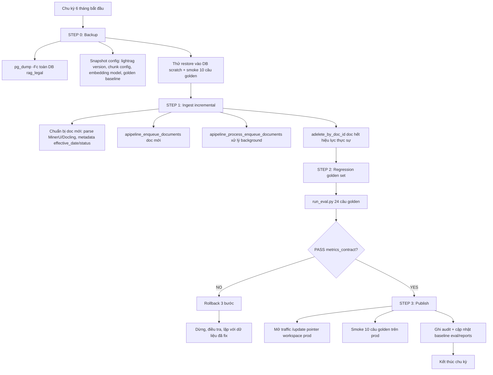

# Research: Storage & Pipeline vận hành — RAG pháp lý BĐS (đất cầm)

> Ngày: 2026-08-09 | Branch: `feat/rag-real-estate-pilot` | Loại: research (KHÔNG code)
> Nguồn: LightRAG v1.5.6 (2026-08-06) — repo HKUDS/LightRAG `main`, docs, PR #3103, discussions.
> Mục tiêu: verify 6 trụ (PG single-backend / incremental 6 tháng / golden set / backup-rollback / anti-hallu / API contract) kèm bằng chứng.

---

## Verdict tổng (6 trụ)

| # | Trụ | Verdict |
|---|---|---|
| 1 | PostgreSQL single-backend | **CHỐT — dùng `PGTableGraphStorage`** (v1.5.6+, plain PG tables, KHÔNG Apache AGE). PGKVStorage + PGVectorStorage + PGTableGraphStorage + PGDocStatusStorage chung 1 DB, `asyncpg` + pgvector, bảng auto-created. |
| 2 | Incremental update | **LightRAG `insert`/`apipeline_*` BẢN CHẤT là incremental** (union node/edge + merge). `adelete_by_doc_id` cho xoá có chọn lọc. KHÔNG cần API tách biệt. |
| 3 | Golden set eval | **Chốt schema + metric contract** — retrieval P@k, citation hit, grounded answer; ngưỡng PASS từ baseline. |
| 4 | Backup & rollback | **pg_dump = backup TOÀN BỘ** (cả 4 storage trong 1 DB). LightRAG export CSV KHÔNG đủ (chỉ text+metadata, không vector/graph). Rollback 3 bước. |
| 5 | Anti-hallucination | **Confidence 3-tier + grounding span-in-chunk** — threshold recompute từ golden set; always-on (không phải optional). |
| 6 | API contract | **Chốt schema `/query` (SSE) + `/review` + `/health`** — dựa trên LightRAG QueryParam/QueryResult chuẩn + lớp wrapper riêng. |

**3 rủi ro lớn nhất** (chi tiết ở cuối mỗi trụ):
1. **Lock-in embedding + storage**: đổi embedding model / đổi storage backend = phải re-index TOÀN BỘ (LightRAG không hỗ trợ migration in-place giữa storage impl). → Chốt cấu hình 1 lần, pin version.
2. **AGE-based `PGGraphStorage` không chạy trên managed PG** (RDS/Supabase/Neon) và chậm hơn ~20x → PHẢI dùng `PGTableGraphStorage`, rollback `ADE` fallback = thư viện cũ.
3. **Query-time filter hiệu lực (`effective_date`/`status`) KHÔNG native** — cần lớp post-retrieval filter riêng; không nghĩ tới sẽ trả version hết hiệu lực.

---

## 1. PostgreSQL single-backend

### Thiết kế đề xuất

Dùng **4 storage impl của LightRAG trên 1 PostgreSQL** (1 service, 1 workspace):

```
LIGHTRAG_KV_STORAGE=PGKVStorage               # LLM cache, text chunks, full docs, entity/relation chunks
LIGHTRAG_VECTOR_STORAGE=PGVectorStorage       # entity/relation/chunk vectors (pgvector)
LIGHTRAG_GRAPH_STORAGE=PGTableGraphStorage    # graph trên bảng thường (JSONB) — KHÔNG AGE
LIGHTRAG_DOC_STATUS_STORAGE=PGDocStatusStorage # trạng thái indexing từng document
```

**Config tối thiểu** (env — CẤM hardcode):
```
POSTGRES_HOST=localhost
POSTGRES_PORT=5432
POSTGRES_USER=...
POSTGRES_PASSWORD=...
POSTGRES_DATABASE=rag_legal
POSTGRES_WORKSPACE=default        # tùy chọn; override WORKSPACE chung
```

- Driver: **`asyncpg`** (connection pool, SSL, retry/backoff có sẵn `POSTGRES_CONNECTION_RETRIES`), **`pgvector`** (`register_vector` + `CREATE EXTENSION IF NOT EXISTS vector` — LightRAG tự chạy).
- Init: `await rag.initialize_storages()` — **auto-create bảng + auto-run migration** (LightRAG có `check_tables` tự ALTER cột thiếu: ví dụ `chunk_id`/`cache_type`/`queryparam` vào `LIGHTRAG_LLM_CACHE`, `llm_cache_list` vào `LIGHTRAG_DOC_CHUNKS`).
- PG version: **16.6 trở lên được hỗ trợ**; `PGTableGraphStorage` chạy trên PostgreSQL 14+ thường (kể cả managed: RDS/Cloud SQL/Supabase/Neon).
- Vector index: HNSW (mặc định, `hnsw_m`/`hnsw_ef`), IVFFlat (`ivfflat_lists`), VCHORDRQ; `HNSW_HALFVEC` cần pgvector ≥ 0.7.0.
- Batch write: 16 MiB / 200 record mỗi upsert, 1000 record mỗi delete — env `POSTGRES_UPSERT_MAX_PAYLOAD_BYTES` etc.
- Isolation: `workspace` field cho PGKV/PGVector/PGDocStatus; bảng riêng `lightrag_graph_nodes`/`lightrag_graph_edges` cho graph.

**Ưu điểm then chốt cho backup**: cả 4 storage nằm chung 1 DB → **`pg_dump` backup TOÀN BỘ** (xem trụ 4).

### By chứng (bằng chứng)

- `lightrag/kg/__init__.py` (`STORAGE_IMPLEMENTATIONS` + `STORAGE_ENV_REQUIREMENTS` + `STORAGES`): đăng ký PGKVStorage / PGVectorStorage / PGGraphStorage / PGDocStatusStorage cùng env `POSTGRES_USER`, `POSTGRES_PASSWORD`, `POSTGRES_DATABASE`; module `.kg.postgres_impl`.
  - https://github.com/HKUDS/LightRAG/blob/main/lightrag/kg/__init__.py
- PR #3103 "feat(kg): add PGTableGraphStorage — PostgreSQL-native graph backend (no AGE dependency)": schema `lightrag_graph_nodes(workspace, namespace, id, properties JSONB)` + `lightrag_graph_edges(workspace, namespace, src_id, tgt_id, properties JSONB, updated_at)`, PK `(workspace, namespace, src_id, tgt_id)`; benchmark PG18: **PGTable RPS 1,431 vs AGE 73; `get_knowledge_graph` 39ms vs 1,099ms (~28x)**; seed 3s vs 434s.
  - https://github.com/HKUDS/LightRAG/pull/3103
- Release v1.5.6 (2026-08-06): "PGTableGraphStorage … will replace the AGE-based `PGGraphStorage` as the preferred graph storage solution for PostgreSQL. … a single database to cover all four storage types."
  - https://newreleases.io/project/github/HKUDS/LightRAG/release/v1.5.6
- `docs/LightRAG-API-Server.md` (HEAD): env cho PG = `POSTGRES_USER`, `POSTGRES_PASSWORD`, `POSTGRES_DATABASE` (+ `POSTGRES_HOST`, `POSTGRES_PORT`); bảng storage: `GRAPH_STORAGE` gồm `NetworkXStorage, Neo4JStorage, PGTableGraphStorage, PGGraphStorage, ...`; workspace override `POSTGRES_WORKSPACE`; "PGTableGraphStorage in its own lightrag_graph_nodes / lightrag_graph_edges tables, PGGraphStorage inside an AGE graph".
  - https://github.com/HKUDS/LightRAG/blob/main/docs/LightRAG-API-Server.md
- `docs/ProgramingWithCore.md` (HEAD): "PostgreSQL can provide a one-stop solution as KV store, VectorDB (pgvector), and GraphDB (PGTableGraphStorage on plain indexed tables, or PGGraphStorage on Apache AGE). **PostgreSQL version 16.6 or higher is supported**."
  - https://github.com/HKUDS/LightRAG/blob/main/docs/ProgramingWithCore.md
- Demo init 4 storage + `await rag.initialize_storages()`: `examples/lightrag_gemini_postgres_demo.py`.
  - https://github.com/HKUDS/LightRAG/blob/main/examples/lightrag_gemini_postgres_demo.py
- `postgres_impl.py`: `CREATE EXTENSION IF NOT EXISTS vector`, `register_vector`, `CREATE EXTENSION IF NOT EXISTS AGE CASCADE` (chỉ PGGraphStorage), batching limits, auto-migration cột.
  - https://github.com/HKUDS/LightRAG/blob/main/lightrag/kg/postgres_impl.py

**Verify khi implement** (lệnh):
```bash
uv add "lightrag-hku==1.5.6" "asyncpg" "pgvector"
python -c "import lightrag; from lightrag import LightRAG; print(LightRAG.__module__)"
uv run python examples/lightrag_gemini_postgres_demo.py   # smoke PG
psql -d rag_legal -c "\dt"        # liệt kê bảng auto-created
```

### Rủi ro

1. **Lock-in storage impl**: "Direct migration between storage implementations is not supported" — đổi `PGTableGraphStorage` ↔ `PGGraphStorage` (AGE) không phải migration in-place (graph nằm nơi khác), phải re-index; LLM cache có thể migrate qua `python -m lightrag.tools.migrate_llm_cache`.
2. **Quên chọn storage trước khi upload đầu tiên**: storage được chốt lúc init; đổi sau = reset workspace.
3. **pgvector version**: HNSW_HALFVEC cần pgvector ≥ 0.7.0 → dùng HNSW thường cho MVP (dimension embedding ~1024-1536 < 2000).
4. PG default `max_connections=100` — pool của cả 4 storage chia chung `ClientManager` nhưng mỗi pool có `max_size` riêng; để `max_connections` đủ.

### Quyết định MVP

- **CHỐT `PGTableGraphStorage`** (v1.5.6+), KHÔNG dùng `PGGraphStorage` (AGE) — chạy được trên mọi PG, nhanh hơn ~20x, không cần image đặc biệt.
- Pin `lightrag-hku==1.5.6` (hoặc phiên bản ổn định mới nhất lúc implement), `asyncpg`, `pgvector`.
- PG 16.6+ (hoặc 17/18), extension `vector` auto qua LightRAG.
- Embedding lock tiếp tục được enforce (xem rủi ro 1).

---

## 2. Incremental update pipeline (6 tháng)

### Thiết kế đề xuất

**LightRAG `insert` BẢN CHẤT là incremental** — không có "full rebuild" riêng. Mỗi lần chạy chỉ xử lý doc mới và merge vào graph cũ:

```
1. Backup (pg_dump + snapshot cấu hình)          → scripts/update_6mo.sh step 0
2. Ingest incremental:
   - apipeline_enqueue_documents(docs_mới)        # chunk + extract entity/relation
   - apipeline_process_enqueue_documents()         # background, không block
   - HOẶC insert(text) đơn giản cho POC
3. Xoá/mark hết hiệu lực doc cũ:
   - adelete_by_doc_id(doc_id)  nếu doc thực sự lỗi thời (vd: quy hoạch cũ thay quy hoạch mới)
   - HOẶC giữ + đánh status=expired trong registry riêng + post-retrieval filter (xem trụ 5)
4. run_eval.py trên golden set → so baseline → PASS/FAIL
5. Publish (đổi symlink/version pointer) hoặc rollback
```

**Cơ chế merge** (bằng chứng lý thuyết, arxiv LightRAG):
- Doc mới D' → graph mới (V', E') bằng cùng pipeline φ.
- Union: V ∪ V', E ∪ E' — merge node/edge trùng, KHÔNG đụng graph cũ.
- Chunk mới → chunk hash ID mới → entity/relation mới trỏ `source_id` mới; entity trùng tên được merge (source_id gộp, `MAX_SOURCE_IDS_PER_ENTITY` giới hạn).
- Xoá doc: `adelete_by_doc_id` xoá chunk, **dùng LLM cache để rebuild entity/relation chung còn tồn tại ở doc khác**, cập nhật vector index, dọn doc status. **Không thể đảo ngược** — luôn backup trước.

### Bằng chứng

- **Insert pipeline incremental**: `docs/ProgramingWithCore.md` — "`apipeline_enqueue_documents` and `apipeline_process_enqueue_documents` allow incremental insertion of documents in the background while the main thread continues executing."
  - https://github.com/HKUDS/LightRAG/blob/main/docs/ProgramingWithCore.md
- **Merge nodes/edges**: `lightrag/operate.py` import `merge_nodes_and_edges`, `collect_kg_merge_candidates`, `rebuild_knowledge_from_chunks`; `lightrag/lightrag.py` import danh sách giống vậy.
  - https://github.com/HKUDS/LightRAG/blob/main/lightrag/lightrag.py
- **Lý thuyết union**: arxiv 2410.05779v3 — "combines the new graph data with the original by taking the union of the node sets V and V′, as well as the edge sets E and E′"; "eliminating the need to rebuild the entire index graph"; GraphRAG phải rebuild community (1,399 × 2 × 5,000 tokens) còn LightRAG merge trực tiếp.
  - https://arxiv.org/html/2410.05779v3
- **Delete by doc id**: `ProgramingWithCore.md` — 5 bước: xoá chunks → xác định entity/relation chỉ thuộc doc này → rebuild entity còn dùng ở doc khác (dùng LLM cache) → cập nhật vector → dọn doc status. "Deletion operations are irreversible".
- **Selective delete + LLM cache**: README chính — "When a document is deleted, the system can use the LLM cache created during indexing to quickly rebuild the affected entities and relationships".
  - https://github.com/HKUDS/LightRAG/
- **Rebuild vector storage** (recovery sau lỗi vector hoặc đổi embedding): tool `rebuild_vdb` — "Drops and rebuilds every vector storage from its authoritative source (graph nodes/edges and the text_chunks KV store). The recovery path after a failed vector write, and after changing the embedding model or dimension."
- **Dedup khi insert**: `lightrag/pipeline.py` — content_hash dedup (`duplicate_kind=content_hash|filename` → FAILED status), tránh insert trùng khi chạy lại.

**Verify khi implement**:
```bash
uv run python -c "
import asyncio
from lightrag import LightRAG
async def main():
    rag = LightRAG(working_dir='./rag_storage', kv_storage='PGKVStorage', ...)
    await rag.initialize_storages()
    await rag.apipeline_enqueue_documents(['doc mới 1', 'doc mới 2'])
    await rag.apipeline_process_enqueue_documents(None)
asyncio.run(main())"
# đếm entity trước/sau: SELECT count(*) FROM lightrag_graph_nodes WHERE workspace='default';
```

### Rủi ro

1. **Chunking mới tác động graph cũ**: thay `chunk_token_size`/parser giữa các chu kỳ → chunk hash đổi → entity/relation cũ giữ nguyên (không bị xoá) nhưng source_id mới thêm; nếu semantic chunking (MinerU/Docling) thay đổi, doc cũ phải re-insert (dedup theo content_hash sẽ nhận trùng → bỏ qua hoặc FAILED). → **Đóng băng chunk config + parser version trong `chunk_options` snapshot** (LightRAG đã freeze `chunk_options` ở enqueue time).
2. **`adelete_by_doc_id` không thể undo** → luôn backup trước; chỉ xoá doc thực sự hết hiệu lực, còn lại mark expired.
3. **Chi phí extraction LLM trên doc mới** vẫn đáng kể (Haiku/aibox qwen rẻ nhưng khối lượng lớn) — batch + retry, đo trước bằng POC.

### Quyết định MVP

- Flow: backup → `apipeline_enqueue_documents` + `apipeline_process_enqueue_documents` → `adelete_by_doc_id` (nếu cần) → regression golden set → publish/rollback.
- Đóng băng: `chunk_token_size`, `chunk_overlap_token_size`, parser (MinerU/Docling), embedding — ghi vào `scripts/update_6mo.sh` + config file, không đổi ngầm giữa chu kỳ.
- Không "rebuild toàn bộ" trừ khi đổi embedding model (khi đó `rebuild_vdb` là recovery path).

---

## 3. Golden set eval

### Thiết kế đề xuất — `eval/golden_set.json`

**Schema** (20-30 câu, phủ 5 loại truy vấn):

```json
{
  "meta": {
    "version": "1.0.0",
    "embedding_model": "aibox:text-embedding-v4",
    "rerank_model": "aibox:qwen3-rerank",
    "lightrag_version": "1.5.6",
    "created_at": "2026-08-09",
    "updated_at": null
  },
  "questions": [
    {
      "id": "G-001",
      "query": "Dự án khu đô thị X ở quận Y có phù hợp quy hoạch chung thành phố Z không?",
      "mode": "hybrid",
      "expected_answer_points": [
        "mã quy hoạch / quyết định phê duyệt",
        "mục đích sử dụng đất",
        "tình trạng hiệu lực"
      ],
      "expected_source_ids": ["doc-2023-qh-014"],
      "expected_entities": ["Khu đô thị X", "Quận Y", "Quy hoạch chung Z"],
      "min_grounded_ratio": 0.8,
      "min_citation_hit": 1,
      "high_stakes": true
    },
    {
      "id": "G-002",
      "query": "Thủ tục công chứng hợp đồng mua bán đất cầm cần giấy tờ gì?",
      "mode": "local",
      "expected_answer_points": ["công chứng", "giấy tờ"],
      "expected_entities": ["Công chứng", "Hợp đồng mua bán"],
      "min_grounded_ratio": 0.7,
      "min_citation_hit": 1,
      "high_stakes": false
    }
  ]
}
```

**3 nhóm câu** (≈ 8-10 câu mỗi nhóm):
- **Local** (entity cụ thể): thủ tục, giấy tờ, 1 văn bản cụ thể → "Thủ tục chuyển nhượng QSDĐ cần gì?"
- **Global/hybrid** (lan truyền graph, nhiều văn bản): quy hoạch chéo, tranh chấp, điều kiện đối chiếu → "Dự án X có mâu thuẫn với quy hoạch Y không?"
- **Rag kiểm soát rủi ro** (high-stakes, phải grounded): thuế, cầm cố, thế chấp, điều kiện pháp lý → "Đất cầm có được phép chuyển nhượng không?"

**Metric contract** (đưa vào `eval/metrics_contract.json` — theo mlops-toolkit §4):

| Metric | Định nghĩa | Hướng | Ngưỡng MVP |
|---|---|---|---|
| `retrieval_p@5` | tỷ lệ expected_source_ids có trong top-5 chunk/entity trả về | higher | ≥ 0.6 |
| `citation_hit_rate` | tỷ lệ câu có ≥1 citation trỏ đúng expected_source | higher | ≥ 0.8 |
| `answer_grounded_ratio` | tỷ lệ span trong câu trả lời thuộc source chunk (LLM-as-judge + span check) | higher | ≥ 0.75 |
| `high_stakes_grounded` | riêng nhóm high-stakes phải grounded tuyệt đối | higher | = 1.0 |
| `no_answer_rate` | câu không có evidence → LLM phải "không đủ thông tin", không bịa | lower | ≤ 0.1 |
| `latency_p95_ms` | p95 thời gian /query | lower | ≤ 10_000 |

PASS = tất cả metric đạt ngưỡng; FAIL → chặn publish (gate).

### `eval/run_eval.py` đo gì

1. **Retrieval-only pass** (`only_need_context=True`): lấy `raw_data` (entities/relations/chunks) → tính `retrieval_p@5`, đếm `expected_entities` xuất hiện.
2. **Answer pass** (`include_references=True`): gọi `/query` đầy đủ → thu response + references + metadata (`total_entities_found`, `final_chunks_count`).
3. **Grounding check**: tách câu trả lời bằng LLM-as-judge (hoặc span overlap đơn giản cho baseline) → `answer_grounded_ratio`.
4. **Citation hit**: `reference_id` trả về có nằm trong `expected_source_ids` không.
5. **No-answer trap**: câu hỏi không có trong corpus → LLM phải từ chối (guardrail).
6. Log toàn bộ ra `eval/reports/run_<timestamp>.json` (+ MLflow nếu có) — so diff vs baseline, CẤM tự promote (gate review).

**Verify khi implement**:
```bash
uv run python eval/run_eval.py --golden eval/golden_set.json --out eval/reports/run_1.json
```

### Rủi ro

1. LLM-as-judge thiên vị → dùng 2 judge (Claude + aibox) lấy đồng thuận, hoặc span-overlap heuristic cho baseline.
2. Golden set bị "học thuộc" nếu query LLM cache → chạy eval với `enable_llm_cache=False` cho câu golden.
3. Ngưỡng tĩnh lệch theo phase (POC vs production) → lưu baseline theo phiên bản, không ghi đè.

### Quyết định MVP

- Golden set 24 câu (8 local / 8 hybrid-global / 8 high-stakes), metrics_contract như trên.
- `run_eval.py` output JSON + so baseline; PASS/FAIL là gate của `update_6mo.sh`.

---

## 4. Backup & rollback

### Thiết kế đề xuất — pg_dump là backup TOÀN BỘ

Vì cả 4 storage (KV/Vector/Graph/DocStatus) nằm chung 1 PostgreSQL → **`pg_dump` backup trọn vẹn** (schema + data + vector), rollback đơn giản nhất. LightRAG export CSV không thể dùng cho khôi phục (chỉ text+metadata).

**Backup (trước update)**:
```bash
pg_dump -h $PGHOST -U $PGUSER -d rag_legal -Fc -f backups/rag_legal_$(date +%Y%m%d).dump
# + snapshot cấu hình: pin lightrag version, chunk config, embedding model, golden set baseline
```

**Rollback (3 bước)**:
```
1. Chặn traffic:   đổi DNS/ingress → app "đang bảo trì" (hoặc stop uvicorn)
2. Phục hồi DB:    pg_dump restore vào DB mới → verify → swap
   createdb rag_legal_rollback
   pg_restore -d rag_legal_rollback backups/rag_legal_20260101.dump
   # verify: SELECT count(*) FROM lightrag_graph_nodes; + chạy golden set con (10 câu) phải PASS
   # swap: rename DB hoặc đổi DATABASE_URL đến DB rollback
3. Xác nhận:       chạy /health + 10 câu golden → mở lại traffic
```

### Bằng chứng

- **LightRAG export CSV KHÔNG đủ**: discussion #2397 — "Right now the CSV export only gives you your text and metadata — it does not export the actual embeddings, graph, or indexes. There's also no direct 'import and restore' feature yet."; "keep your original documents/chunks, any metadata, any preprocessing/chunking logic … re-ingest the data and the system will regenerate the embeddings and graph."
  - https://github.com/HKUDS/LightRAG/discussions/2397
- **Export data docs**: `docs/LightRAG-API-Server.md` có mục export (CSV) — chỉ text + metadata.
- **Không migration in-place giữa storage** (thảo luận #1912): "each graph_storage backend writes its own format, so you can't just swap … using the same working_dir" → backup phải ở tầng DB (pg_dump), không phải tầng LightRAG.
  - https://github.com/HKUDS/LightRAG/discussions/1912
- **LLM cache migration** (giảm chi phí re-index khi đổi storage): `python -m lightrag.tools.migrate_llm_cache` — `README_MIGRATE_LLM_CACHE.md`.

**Verify khi implement**:
```bash
pg_dump ... && pg_restore ... && psql -c "SELECT count(*) FROM lightrag_graph_nodes;"
uv run python -m lightrag.tools.migrate_llm_cache --help   # nếu cần di cư cache
```

### Rủi ro

1. **pg_dump toàn DB chứa cả DWH/ứng dụng khác nếu dùng chung instance** → tách DB `rag_legal` riêng (1 instance = RAG, an toàn dump).
2. Vector index (HNSW) sau pg_restore giữ nguyên (pgvector lưu index trong DB) — nhưng chạy `ANALYZE` + test latency sau restore.
3. Doc đã `adelete_by_doc_id` trước khi phát hiện lỗi → MẤT doc đó khi rollback bằng dump cũ (dump cũ chưa có deletion) → rollback = quay về trạng thái trước update, doc mới phải insert lại — chấp nhận được với chu kỳ 6 tháng.

### Quyết định MVP

- Backup = `pg_dump -Fc` + snapshot config; rollback 3 bước như trên.
- NOT dùng LightRAG CSV export cho restore.
- Thêm `ANALYZE` + smoke golden (10 câu) sau restore trước khi mở traffic.

---

## 5. Anti-hallucination — Confidence 3-tier

### Thiết kế đề xuất

```
                               ┌────────────────────────────────────────────┐
chunk retrieval ──rerank──►   │  API /query (LightRAG hybrid/mix)          │
                               │  + enable_rerank=true                     │
                               └──────────────────┬─────────────────────────┘
                                                  │ raw_data: entities, relations,
                                                  │ chunks, references, metadata
                                                  ▼
                              ┌────────────────────────────────────────────┐
                              │  api/confidence.py  (3-tier)              │
                              │  1. grounding: mọi span trong câu trả lời │
                              │     phải nằm trong source chunk (text)    │
                              │  2. rerank score từng chunk               │
                              │  3. đếm nguồn độc lập (source_ids)        │
                              │  4. threshold từ golden set (recompute)   │
                              └──────────────────┬─────────────────────────┘
                                                 ▼
                              HIGH (≥2 nguồn + rerank ≥0.8 + grounding pass)
                              MEDIUM (grounding pass, yếu 1 tiêu chí)
                              LOW (grounding fail HOẶC <2 nguồn)
                              LOW + high_stakes keyword → review queue bắt buộc
```

**Công thức (MVP)**:
```
score_rerank    = MIN(score rerank của top-k chunk)   # hay mean top-3
grounding_pass  = ratio(span câu trả lời thuộc source chunk) ≥ 0.8
n_sources       = số source_id (doc) độc lập trong references

HIGH   = grounding_pass AND n_sources ≥ 2 AND score_rerank ≥ 0.8
MEDIUM = grounding_pass AND (n_sources < 2 OR score_rerank < 0.8)
LOW    = NOT grounding_pass  (hoặc không có evidence → no-answer fallback)
```

**Threshold recompute từ golden set**: chạy `run_eval.py` → phân phối (score_rerank, n_sources, grounded_ratio) trên câu PASS → lấy percentile 20 của mỗi metric làm threshold. Lưu vào `eval/thresholds.json`; thay đổi cần re-eval cả golden set.

**Grounding check implement**:
1. Parse answer → câu / span (tách câu, hoặc LLM-as-judge trả câu + claim).
2. Trích phần answer dạng markdown/plain; với mỗi câu, tìm span khớp trong concatenated source chunks (normalize whitespace/unicode) — khớp substring ≥ 40% câu.
3. Không khớp → câu đó UNGROUNDED → nếu ratio < 0.8 → LOW.
4. Fallback: nếu không có retrieved evidence → trả lời "Không đủ thông tin" + `confidence=LOW` (guardrail no-answer).

**High-stakes keywords**: `cầm cố, thế chấp, chuyển nhượng, công chứng, đất công, quy hoạch, thuế, diện tích, sổ đỏ` → bất kỳ câu LOW/MEDIUM → `/review` queue.

### Bằng chứng

- **Citation/grounding là discipline bắt buộc của pipeline LightRAG**: LightRAG trả `references` (`reference_id` + `file_path`) khi `include_references=True`; `QueryResult.reference_list` đọc từ `raw_data.data.references`.
  - https://github.com/HKUDS/LightRAG/blob/main/lightrag/base.py
- **Rerank native**: `QueryParam.enable_rerank` (mặc định true nếu có rerank model cấu hình), `chunk_top_k` = số chunk giữ sau rerank.
- **Guardrail no-answer**: ràng buộc nghiệp vụ (CLAUDE.md) — legal hallucinate ~1/6; fake citation nguy hiểm nhất → confidence + review là bắt buộc.
- Golden-set-driven threshold = mlops-toolkit §4 (metric contract + baseline comparison, không promote theo cảm tính).

**Verify khi implement**:
```bash
uv run python -c "from api.confidence import compute_confidence; print(compute_confidence(answer, chunks, rerank_scores))"
# unit test 3 tier: 2 nguồn + rerank 0.85 + grounding pass → HIGH
```

### Rủi ro

1. **Span matching naive dễ false-positive** với văn bản pháp luật (trích dẫn điều/khoản lặp) → dùng chuẩn hoá văn bản + minimum length; high-stakes bắt buộc LLM-judge.
2. **Threshold reeval khi đổi query LLM** (Sonnet → aibox lớn) vì phân bố grounding đổi.
3. Rerank score scale khác nhau giữa aibox qwen3-rerank vs bge-reranker (fallback) → threshold phải ghi kèm model rerank đã dùng.

### Quyết định MVP

- Confidence 3-tier luôn bật; threshold khởi tạo từ golden set, recompute mỗi chu kỳ 6 tháng.
- Grounding = span-overlap 0.8 + LLM-judge cho high-stakes.
- LOW hoặc high-stakes kém → bắt buộc human review.

---

## 6. API contract — FastAPI

### Thiết kế đề xuất — wrapper riêng, kế thừa LightRAG QueryParam/QueryResult

Không dùng trực tiếp `lightrag-server` (thiếu auth/audit/review của ta) — dùng LightRAG làm engine, viết `api/main.py` riêng với 3 endpoint.

### `POST /query` (SSE streaming + non-stream)

**Request**:
```json
{
  "q": "Dự án X có phù hợp quy hoạch chung Tp.HCM không?",
  "mode": "hybrid",
  "top_k": 20,
  "chunk_top_k": 8,
  "include_references": true,
  "response_type": "Multiple Paragraphs",
  "stream": true,
  "user_id": "broker-001"
}
```

**Response (non-stream)**:
```json
{
  "answer": "Dự án X … (trích điều/khoản).",
  "confidence": "HIGH",
  "confidence_detail": {
    "grounding_ratio": 0.92,
    "n_sources": 3,
    "rerank_score_min": 0.84,
    "tier": "HIGH"
  },
  "references": [
    {"reference_id": "1", "file_path": "docs/quyhoach/X_QD_2023.pdf", "chunk_id": "chunk-…"}
  ],
  "chunks": [
    {"chunk_id": "chunk-…", "content": "…", "file_path": "…"}
  ],
  "metadata": {
    "query_mode": "hybrid",
    "keywords": {"high_level": ["quy hoạch"], "low_level": ["dự án X"]},
    "processing_info": {
      "total_entities_found": 12,
      "total_relations_found": 8,
      "final_chunks_count": 6
    },
    "latency_ms": 3200
  },
  "audit_id": "au-20260809-0001"
}
```

**SSE stream** (khi `stream=true`):
```
event: start      data: {"audit_id": "au-…"}
event: token      data: {"text": "Dự án X …"}
event: references data: {"references": [...]}
event: confidence data: {"confidence": "HIGH", "detail": {...}}
event: done       data: {}
```

### `GET /review` + `POST /review/{id}/resolve` (human review queue)

**`GET /review?status=pending`**:
```json
{
  "items": [
    {
      "review_id": "rv-…",
      "query": "…",
      "answer": "…",
      "confidence": "LOW",
      "reason": "grounding_fail|high_stakes|low_sources",
      "references": [...],
      "audit_id": "au-…",
      "created_at": "2026-08-09T10:00:00Z"
    }
  ]
}
```

**`POST /review/{id}/resolve`**:
```json
{"verdict": "approved|rejected|edited", "edited_answer": "…", "note": "…"}
```

### `GET /health`

```json
{
  "status": "ok",
  "checks": {
    "postgres": "ok",
    "embedding_api": "ok",
    "rerank_api": "ok",
    "graph_nodes": 15420,
    "chunks": 48210,
    "last_backup": "2026-08-09T08:00:00Z"
  }
}
```

### Bằng chứng

- **QueryParam/QueryResponse chuẩn LightRAG**: `lightrag/base.py` — `mode` (local/global/hybrid/naive/mix/bypass), `top_k`, `chunk_top_k`, `enable_rerank`, `include_references`, `stream`, `response_type`, `only_need_context`; `QueryResult` (`content`, `response_iterator`, `raw_data`, `reference_list`, `metadata`).
  - https://github.com/HKUDS/LightRAG/blob/main/lightrag/base.py
- **QueryRequest/QueryResponse server**: `lightrag/api/routers/query_routes.py` — `mode` default `mix`, `top_k`, `chunk_top_k`, `only_need_context`, `response_type`, `include_references`; response có `entities`, `relationships`, `chunks`, `references`, `metadata.processing_info` (`total_entities_found`, `final_chunks_count`).
  - https://github.com/HKUDS/LightRAG/blob/main/lightrag/api/routers/query_routes.py
- **Streaming**: `QueryResult.response_iterator` (AsyncIterator[str]) — nền tảng cho SSE.
- **Audit**: phải tự build (`db/audit.sql`) — LightRAG không audit log query; CLAUDE.md yêu cầu audit log (query, chunk IDs, rerank score, source_ids, confidence, verdict).

**Verify khi implement**:
```bash
uv run uvicorn api.main:app --port 8000
curl -N -X POST localhost:8000/query -H 'Content-Type: application/json' \
  -d '{"q":"quy hoạch dự án X","mode":"hybrid","stream":true}'
curl localhost:8000/health
```

### Rủi ro

1. SSE + asyncpg + LightRAG async: phải dùng `aquery` (coroutine) trong handler, không `query` sync (lỗi "event loop already running" — `_run_sync` có guard).
2. `mode` mặc định LightRAG là `mix` — ta chọn `hybrid` mặc định cho legal (CLAUDE.md), expose `mode` cho power user.
3. Auth: MVP cần ít nhất API key header + audit_id trace ra log; không để `/review` public.

### Quyết định MVP

- FastAPI wrapper riêng, 3 endpoint `/query` (SSE + non-stream), `/review`, `/health`.
- Schema theo LightRAG QueryParam/QueryResult + trường confidence/audit riêng của ta.
- Audit log bắt buộc mọi request.

---

## 7. Flow update 6 tháng + checklist rollback

### Sơ đồ flow (mermaid)



### Checklist runbook rollback (3 bước)

```
[ ] 1. CHẶN TRAFFIC
     - [ ] Dừng uvicorn (systemctl stop rag-api) HOẶC chuyển DNS/ingress sang trang "bảo trì"
     - [ ] Xác nhận /health không còn trả ok

[ ] 2. PHỤC HỒI DB
     - [ ] createdb rag_legal_rollback
     - [ ] pg_restore -d rag_legal_rollback backups/rag_legal_<ngay_truoc_update>.dump
     - [ ] VERIFY restore:
         - [ ] SELECT count(*) FROM lightrag_graph_nodes;  (khớp số trước update)
         - [ ] SELECT count(*) FROM lightrag_chunks_vdb;   (nếu bảng vector — hoặc qua debug endpoint)
         - [ ] Chạy 10 câu golden trên DB rollback → PASS
     - [ ] Swap: đổi DATABASE_URL trỏ rag_legal_rollback (hoặc DROP rag_legal + RENAME)
     - [ ] ANALYZE; kiểm tra latency vector query p95

[ ] 3. XÁC NHẬN & MỞ LẠI
     - [ ] /health = ok (postgres ok, embedding ok, rerank ok)
     - [ ] Smoke 10 câu golden trên prod đạt ngưỡng
     - [ ] Mở lại traffic
     - [ ] Ghi audit: rollback do lý do gì, thời gian, ai duyệt
```

### Nguyên tắc
- **Mọi bước đều có verify trước khi sang bước sau** — không skip smoke.
- **Rollback KHÔNG phục hồi doc đã `adelete` từ update lỗi** (dump lấy trước update) → doc mới insert lại ở chu kỳ sau; chấp nhận với chu kỳ 6 tháng.
- Backup config (lightrag version / chunk / embedding) là **bắt buộc** — backup DB không đủ nếu tuần tự upgrade LightRAG.

---

## Phụ lục — Verify tổng hợp khi implement

| Thành phần | Lệnh verify |
|---|---|
| Cài đặt | `uv add "lightrag-hku==1.5.6" asyncpg pgvector` |
| PG storage | `uv run python examples/lightrag_gemini_postgres_demo.py` → bảng auto-created |
| Incremental | Insert 2 đợt doc, đếm `lightrag_graph_nodes` tăng dần, không rebuild |
| Golden set | `uv run python eval/run_eval.py` → JSON + PASS/FAIL |
| Query API | `curl -N -X POST localhost:8000/query -d '{"q":"...","stream":true}'` |
| Confidence | unit test 3 tier (≥2 nguồn + rerank ≥0.8 + grounding pass → HIGH) |
| Backup/rollback | dry-run: pg_dump → restore vào DB scratch → smoke 10 câu |
